# Physics-Aware KiCad Placement & Routing Engine

A **KiCad placement and routing engine** that combines topological (TopoR-style) layout with **physics simulations** (Ngspice, OpenEMS) so boards are not only fully routed, but also validated for real-world electrical behavior.

Inspired by [TopoR](https://en.wikipedia.org/wiki/TopoR) and the rubberband topological literature (Dayan 1997; Dai et al. 1991)—gridless free-angle routing, no preferred directions, clearance-aware multi-layer paths with vias—and by modern multi-objective / RL placement research that rewards **post-route and physical** quality rather than raw HPWL alone.

**Inputs that unlock best results:** full KiCad projects (`.kicad_pcb` / `.kicad_sch`) plus **well-labeled nets** with **weights** and **notes**. Labels can be authored in YAML or **imported** from KiCad netclasses and schematic fields.

> **Deep dive:** algorithm survey, paper notes, and full bibliography → **[RESEARCH.md](RESEARCH.md)**  
> **Training data:** corpora and conversion paths → **[DATASETS.md](DATASETS.md)**

---

## Quick start

```bash
python3 -m venv .venv && source .venv/bin/activate
pip install -e ".[dev]"

# Example labeled-net config
physics-router init-config -o examples/placement_config.yaml

# Import labels from KiCad netclasses + schematics
physics-router import-nets \
  --pcb path/to/board.kicad_pcb \
  --project-dir path/to/project \
  -o placement_config.yaml

# Multi-candidate physics-aware placement
physics-router place \
  --config placement_config.yaml \
  --pcb path/to/board.kicad_pcb \
  --out-pcb board_placed.kicad_pcb \
  --out-json placement_result.json

# Clearance-aware TopoR free-angle routing
physics-router route \
  --config placement_config.yaml \
  --pcb board_placed.kicad_pcb \
  --clearance 0.2 \
  --out-json route_result.json \
  --out-pcb board_routed.kicad_pcb

# OpenEMS mesh export (placement + routes and/or Gerbers)
physics-router export-openems \
  --config placement_config.yaml \
  --pcb board_routed.kicad_pcb \
  --gerber F.Cu=fab/F_Cu.gbr \
  --gerber B.Cu=fab/B_Cu.gbr \
  --out-dir openems_export
```

Synthetic demo (no PCB file):

```bash
physics-router place --config examples/placement_config.yaml
physics-router route --config examples/placement_config.yaml --clearance 0.2
physics-router export-openems --config examples/placement_config.yaml --out-dir openems_export
```

---

## Research: best algorithms & methods

This section synthesizes **scientific literature**, industrial practice, and community discussion into an algorithm stack for PCB place-and-route. Details and the full bibliography live in [RESEARCH.md](RESEARCH.md).

### Placement — what the literature supports

| Family | Core idea | Representative work | Role in a modern stack |
|--------|-----------|---------------------|------------------------|
| **Simulated annealing** | Stochastic accept/reject moves with cooling schedule | Kirkpatrick et al. 1983; PCB baselines in Holtz/Merrill-style work; Vassallo DATE 2024 | Strong default global placer; multi-objective energy |
| **Genetic / evolutionary** | Population search, multi-objective | Jain & Gea 1996; Ismail et al. 2012; multi-objective GA theses | Pareto thermal vs wirelength |
| **Analytical / force-directed** | Continuous WL + density (springs / ePlace-like) | Hall 1970; ePlace/RePlAce lineage; thermal force models | Fast global seeds; thermal spread |
| **Spectral / partitioning** | Laplacian eigenmaps, min-cut clusters | NS-Place init (arXiv:2210.14259) | Floorplan seeds & affinity clusters |
| **Net-separation / congestion** | Max-margin separators between net convex hulls (SVM-like) + MILP legalize | **NS-Place** (Cheng, Ho, Holtz 2022) | Huge gains in vias/DRVs vs manual when FreeRouting-evaluated |
| **Reinforcement learning** | Sequential place as MDP; graph/CNN policy; adaptive rewards | Crocker MIT 2021; Vassallo/Bajada DATE 2024; Lim et al. arXiv:2602.23540; IC: Mirhoseini/Goldie *Nature* 2021 | Learn policies; use **post-route** metrics in reward |
| **Component-centric heuristics** | Fix large IC; place passives by pins/power | Lim et al. 2026; common expert practice | Practical prior inside SA/RL |

**Consensus findings**

1. **HPWL alone is not enough** for PCB—post-route wirelength, via count, DRC, and physics matter (Crocker 2021; Vassallo 2024; NS-Place experiments).
2. **Fixed connectors and regions** dominate quality; free global search without mechanicals is unrealistic.
3. **SA remains a competitive baseline** against early RL on small/medium boards; RL shines with transfer and good rewards.
4. **Congestion-aware placement** (net separation, density) reduces routing failure more than pure length minimization (NS-Place: large cuts in DRVs/unrouted nets/vias on 14 real PCBs).

### Routing — what the literature supports

| Family | Core idea | Representative work | Role |
|--------|-----------|---------------------|------|
| **Maze / Lee / A\*** | Grid BFS or heuristic search | Lee 1961; Hadlock; A\* clearance costs | Guaranteed path if one exists; slow dense |
| **Line-probe** | Sparse line search | Hightower; Mikami–Tabuchi | Fast sparse boards |
| **Shape-based / gridless** | Push-aside geometry, Specctra DSN | FreeRouting; commercial Specctra-class | Production density |
| **Topological / rubberband** | Topology first; free-angle geometry; deform under clearance | Dayan PhD 1997; Dai/Dayan/Staepelaere DAC 1991; **TopoR**; Blake Toporouter | Fewer vias; no forced H/V layers |
| **Escape / pair-aware** | BGA fanout, differential co-route | Lin et al. ASP-DAC 2021 | HDI / high-speed |
| **DRL + MCTS** | Search + learned policy | He PhD 2024 (Iowa State); multi-agent RL 2024 | Hard nets; long horizon |
| **CNN + A\*** | Learned cost maps guide A\* | Unet-Astar ~2023 | Faster guided maze |
| **World-model RL + FR** | Dreamer-style + FreeRouting env | DreamerV3+FR 2026 | Hybrid ML + classical |
| **Thermal / SI-aware** | Route under thermal or EM objectives | TRouter; industrial SI tools | Physics close-loop |

**TopoR / rubberband takeaway:** absence of preferred routing directions and free angles (optionally arcs) often reduces vias and crosstalk versus strict 45°/90° channel routing—central to this project’s router design.

### Physics-in-the-loop (why we score more than geometry)

| Objective | Research / practice method |
|-----------|----------------------------|
| Power-loop inductance / EMI | Minimize loop area; partial-L models; OpenEMS FDTD |
| IR drop / PI | Sheet-resistance on power & high-current nets |
| Return path | HS/EMI nets near GND reference (stackup-aware) |
| Matrix / CPX match | Length skew within charlieplex groups |
| Signal integrity | Length match, impedance stackup, 2.5D/3D EM |
| Thermal | Force-directed heat; FEM |
| Circuit behavior | Ngspice with estimated parasitics |
| Accurate 3D copper | **KiCad STEP** (tracks, pads, mask, silk) for OpenEMS/FEM |
| Routability | Net-separation; post-route FreeRouting + **KiCad DRC** |

Commercial and research systems increasingly treat placement as a **constrained multi-objective** problem (safe RL / CMDP surveys 2024–2025), not unconstrained wirelength minimization.

### Recommended hybrid stack (literature → this engine)

```
Labeled nets (classes, weights, notes)
        │
        ▼
Floorplan seed (regions + fixed parts + optional spectral clusters)
        │
        ▼
Global place — multi-candidate SA (→ future RL policy)
   energy: HPWL, loop L, IR drop, return path, CPX match,
           overlap, density, thermal, EMI
        │
        ▼
Physics rank — Ngspice + OpenEMS proxies; STEP for accurate 3D
        │
        ▼
TopoR free-angle route + rubberband cleanup + KiCad DRC
        │
        ▼
Post-route metrics / DRC → re-place if vias/WL/copper fails
```

### How physicsRouter maps to the research

| Literature method | Our implementation (today) |
|-------------------|----------------------------|
| SA multi-objective place | `placement.py` multi-candidate SA |
| Net criticality / weights | `NetLabel` + `import-nets` from KiCad |
| Net-separation / regions | Region constraints + density term (full NS-Place MILP: future) |
| Dayan/TopoR free-angle | `router.py` LOS → detours → A\* → **rubberband cleanup** + vias |
| Lee/A\* maze | Grid A\* fallback inside free-angle search |
| Post-route / physical rewards | IR, loop L, return path, CPX match; spice/EMI; **KiCad DRC** |
| Accurate EM geometry | `export-step` tracks/pads/mask/silk for OpenEMS/FEM |
| RL placement/routing | Architecture ready; SA baseline first (as in DATE 2024 comparisons) |
| FreeRouting / Specctra | DSN path documented; optional external baseline |
| PCBench / open corpora | [DATASETS.md](DATASETS.md) |

### Community & industry signals (X and practice)

Public discussion and product work reinforce the hybrid stack:

- **RL at commercial scale** for autorouting (e.g. DeepPCB: reinforcement learning, large routing volume, multi-EDA including KiCad).
- **Classical routers still matter** when ML tools fail on dense interfaces—engineers report writing fast grid-based KiCad autorouters that succeed where FreeRouting/DeepPCB struggled (community posts on hard memory-interface boards).
- **Physics-aware and agentic tools** (Quilter-style physics routing; Flux / LLM + KiCad plugins) accelerate prototypes; high-speed and safety-critical boards still need expert SI/EMI review.
- **Dedicated layout engines** (separate from general coding agents) are emerging for faster place/route with less rework.

These match research consensus: **learn when you have rewards and data; keep topological/classical cores for legality and free-angle geometry; always close the loop with physics.**

---

## Import nets from KiCad

`import-nets` builds `NetLabel` entries from:

| Source | What is read |
|--------|----------------|
| `.kicad_pcb` `(net_class …)` / `(add_net …)` | Class name, clearance, track width, class notes |
| `.kicad_pcb` `(net id "name")` | Net inventory |
| `.kicad_sch` labels / global / hierarchical | Net names + shapes / properties |
| Schematic text `NET: note…` | Designer notes attached to nets |

Heuristics map names/classes → `power` / `ground` / `clock` / `differential` / … with default **weights**, **critical** flags, `simulate_spice` / `simulate_em`, and auto **power_loop_group** for switcher nets.

```bash
physics-router import-nets --pcb board.kicad_pcb --sch root.kicad_sch -o placement_config.yaml
physics-router import-nets --pcb board.kicad_pcb --project-dir . -o placement_config.yaml --override
```

## Labeled nets (YAML)

```yaml
nets:
  - name: SW
    net_class: power
    weight: 5.0
    critical: true
    power_loop_group: buck1
    emi_sensitive: true
    simulate_spice: true
    simulate_em: true
    notes: "Switcher node — place L and FET tight."
```

Full example: [`examples/placement_config.yaml`](examples/placement_config.yaml).

## Placement (physics-ranked multi-candidate)

```
KiCad PCB + labeled nets
  → seed N region-aware candidates
  → simulated annealing (weighted WL, loop area, critical nets, overlap, density, thermal, EMI)
  → Ngspice / OpenEMS proxies on every candidate
  → best → .kicad_pcb + JSON
```

## Design rules, stackup, and multilayer routing

The router **loads KiCad board rules** so geometry never undercuts fab constraints:

| Source | Used for |
|--------|----------|
| `.kicad_pcb` `(layers)` / `(setup (stackup …))` | Copper layer list, dielectric stack, thickness, εᵣ |
| `.kicad_pro` `design_settings.rules` | min clearance, track, via, annular, microvia flags |
| `.kicad_pro` `net_settings.classes` | Per-class clearance, track width, via size/drill |
| Placement labels | Net priority, pair co-route, power vs signal layer preference |

```bash
# Inspect rules extracted from a board (e.g. HALO-90 is 4-layer)
physics-router rules --pcb path/to/board.kicad_pcb

# Pre-route methodology checks (density, layers, escape, via budget)
physics-router pre-route --config placement_config.yaml --pcb path/to/board.kicad_pcb

# Route using KiCad min_clearance / widths / full copper stack
physics-router route --config placement_config.yaml --pcb path/to/board.kicad_pcb \
  --out-json route_result.json --out-pcb board_routed.kicad_pcb
```

### Policies that make routing easier (research-backed)

1. **Respect DRC floors** — clearance/width/via never below KiCad minima.  
2. **Stackup-aware layers** — 4L: signals prefer outer; power/ground prefer inners (plane roles).  
3. **Via minimization** — complete on one layer when possible; through-vias only if blind/buried disabled.  
4. **Net ordering** — GND/power → high-speed/CPX → pairs → general.  
5. **Escape-then-area** — fan out dense packages before long runs (`pre-route` escape hints).  
6. **Pair co-routing** — SDA/SCL (etc.) same layer, matched length notes.  
7. **H/V preferred per layer** (optional note) while free-angle LOS still used when clear.  
8. **Pre-route density test** — high pins/cm² ⇒ suggest more layers before search.  
9. **Physics proxies** — loop area / EMI / ngspice before committing copper.

See [RESEARCH.md](RESEARCH.md) §6 for literature (layer assignment, MLV-CBS, 3D geometric routing, MCTS multilayer).

## Clearance-aware TopoR routing

| Feature | Behavior |
|---------|----------|
| Free angles | LOS + corner detours + A\* + rubberband (not only 45°/90°) |
| Clearance | **KiCad min_clearance** (or override), pad obstacles, same-net may pass |
| Track/via size | From **net class + DRC minima** |
| Priority | High-weight / critical nets first (power → CPX → pairs → signal) |
| Multi-layer | All copper layers from stackup; layer preference by net class |
| Copper paint | Routed traces become obstacles for later nets |
| Output | JSON + optional `(segment)` / `(via)` append to `.kicad_pcb` |

```bash
physics-router route --config placement_config.yaml --pcb board.kicad_pcb \
  --out-json route_result.json --out-pcb board_routed.kicad_pcb
```

## OpenEMS / FEM geometry (STEP + JSON)

KiCad can export a **STEP** of the board including **tracks, pads, zones, inner copper, soldermask, and silkscreen** — far more accurate for OpenEMS / FEM than extruded rectangles alone.

```bash
# Full simulation STEP (copper + mask + silk, board body, no components)
physics-router export-step --pcb board.kicad_pcb --out-dir sim_geometry

# Single STEP path
physics-router export-step --pcb board.kicad_pcb -o board_sim.step

# Net-filtered copper (e.g. charlieplex only)
physics-router export-step --pcb board.kicad_pcb --out-dir sim_geometry --net-filter 'CPX*'
```

| Artifact | Content |
|----------|---------|
| `board_with_copper.step` / `*_full.step` | KiCad STEP: tracks, pads, zones, mask, silk |
| `board_geometry.json` | Lightweight polyline/box primitives (mm) |
| `simulate_board.py` | CSXCAD/openEMS driver from JSON + stackup |
| `OPENEMS_README.txt` | How to run |

```bash
physics-router export-openems \
  --config placement_config.yaml \
  --pcb board.kicad_pcb \
  --out-dir openems_export
# → also attempts STEP when kicad-cli is available
```

### Other high-impact features

| Feature | Command / module | Why |
|---------|------------------|-----|
| **DRC-validated copper** | `drc`, `route --drc` | Official KiCad DRC JSON on written boards |
| **Rubberband cleanup** | auto in `multilayer_route` | Shortens free-angle paths under clearance (Dayan-style) |
| **IR drop + loop L** | `score` / placement energy | Power integrity proxies for coin-cell / GPIO drive |
| **Return-path score** | placement energy | HS/EMI nets near GND reference |
| **CPX length match** | placement energy | Uniform LED matrix drive paths |
| **KiCad renders** | `render`, `generate_kicad_renders.py` | pcbnew plots + 3D PNGs |

## Architecture

| Module | Role |
|--------|------|
| `models` | Net labels, regions, scores |
| `config_io` | YAML/JSON config |
| `net_import` | KiCad netclass + schematic → labels |
| `design_rules` | Stackup + DRC + net classes from `.kicad_pcb` / `.kicad_pro` |
| `kicad_io` | Read/write footprints; attach copper layers / rules |
| `physics` | Multi-objective cost + Ngspice/OpenEMS backends |
| `placement` | Multi-candidate SA + ranking |
| `router` | Clearance-aware free-angle TopoR core |
| `routing_strategies` | Pre-route tests, net order, multilayer DRC policy |
| `openems_export` | Mesh/geometry from **KiCad stackup** + Gerbers |
| `kicad_tools` | **DRC**, **SVG/3D render**, **STEP** (tracks/mask/silk), pcbnew plot |
| `cli` | `physics-router` entry point |

## Setup

- Python 3.10+
- KiCad 8+ (real projects)
- Ngspice (optional)
- OpenEMS + CSXCAD (optional)

```bash
pip install -e ".[dev]"
pytest
```

## Test project: HALO-90

Real open-source wearable PCB ([openKolibri/halo-90](https://github.com/openKolibri/halo-90)) — 24 mm LED earring, STM8L, 90 charlieplexed LEDs, CR2032, **4-layer** stackup.

```bash
git clone git@github.com:openKolibri/halo-90.git third_party/halo-90
physics-router score \
  --config examples/halo-90/placement_config.yaml \
  --pcb third_party/halo-90/pcb/halo-90.kicad_pcb

# Regenerate figures + JSON in docs/images and examples/halo-90
python scripts/generate_docs_images.py
```

Net weights, power/EMI notes, fixed mechanicals, and regions: [`examples/halo-90/`](examples/halo-90/).

### Example results (measured)

Board: **111** footprints, **23** nets, copper layers `F.Cu / In1.Cu / In2.Cu / B.Cu`.

| Step | Time | Result |
|------|------|--------|
| `score` (+ ngspice/OpenEMS proxies) | **0.043 s** | total cost ≈ 1.65×10⁵ (multi-objective) |
| `pre-route` | **&lt;0.01 s** | density ≈ 39 pins/cm²; 4L advice; via floor ≈ 5 |
| `route-guide` (free-angle) | **11.1 s** | **207** segments, **854.1 mm**, 0 vias, 0 unrouted |
| `route` clearance grid 1 mm + KiCad DRC | **34.6 s** | **208** segments, **854.5 mm**, 0 vias, 0 unrouted |

Full machine dump: [`examples/halo-90/benchmark_results.json`](examples/halo-90/benchmark_results.json)  
Route geometry: [`examples/halo-90/route_guide.json`](examples/halo-90/route_guide.json), [`examples/halo-90/route_result.json`](examples/halo-90/route_result.json)

> **Note:** Dense charlieplex geometry still reports many soft clearance-violation flags at coarse grid (router falls back to straight free-angle links). Finer grids improve legality but cost much more CPU — use `pre-route` recommendations and iterate.

### Visualizations (analysis)

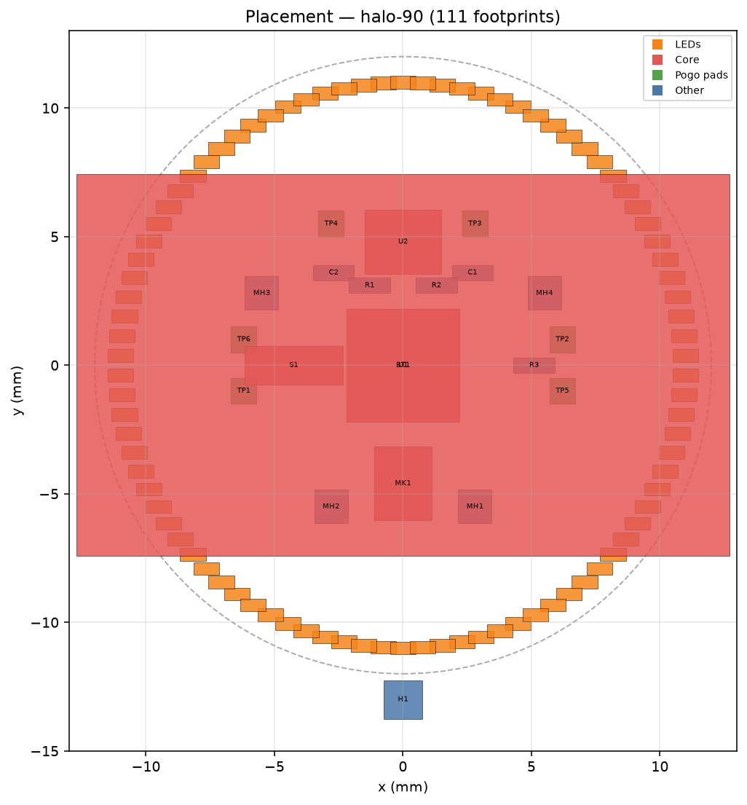

*Placement: LED ring (orange), core MCU/battery/sensors (red), pogo pads (green).*

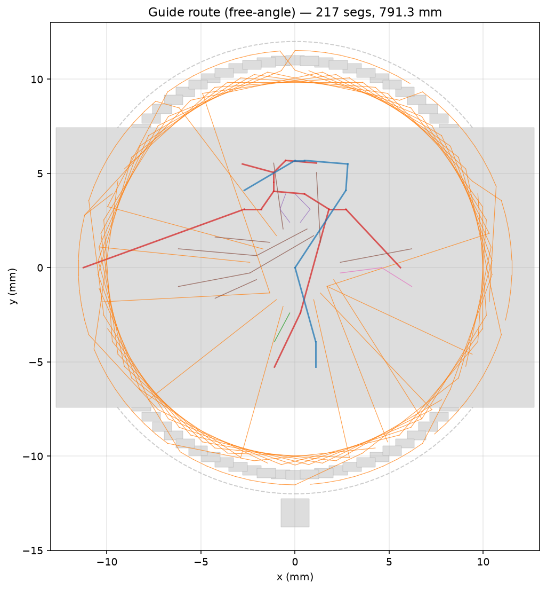

*TopoR-style free-angle **guide** routes — nets colored by class (power red, ground blue, CPX orange, analog green, I2C purple).*

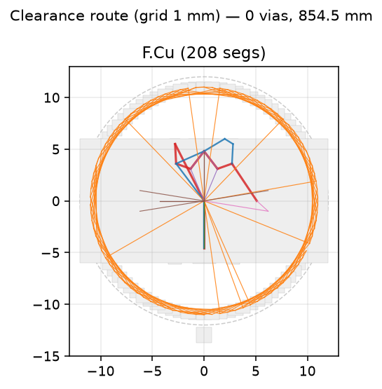

*Clearance-aware multilayer route (1 mm grid), one panel per copper layer used.*

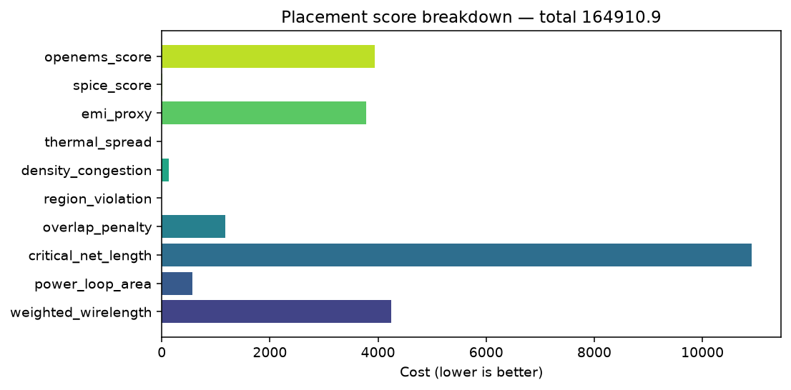

*Multi-objective placement score terms (wirelength, critical nets, EMI, density, spice/openEMS proxies).*

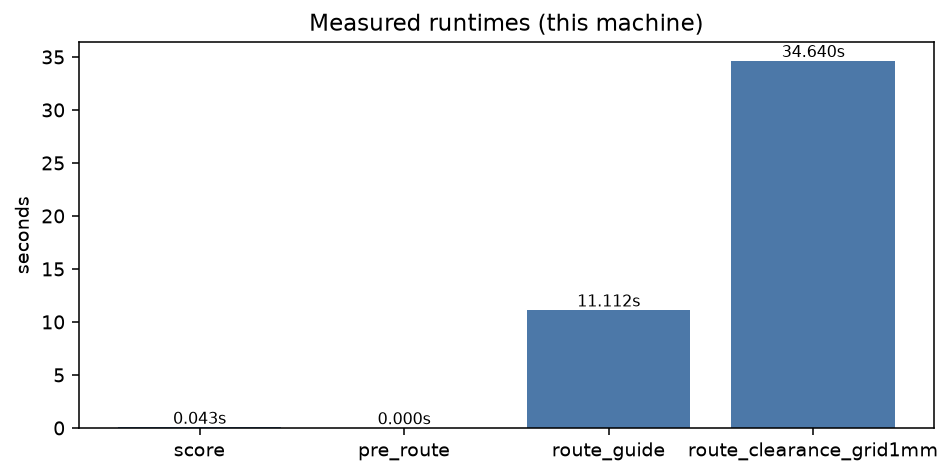

*Wall-clock times for the steps above on the machine that generated these assets.*

### Official KiCad renders (pcbnew / kicad-cli)

Board graphics below are produced by **KiCad itself**, not matplotlib:

- **2D layer plots** — `kicad-cli pcb export svg` (plot engine) and **pcbnew** `PLOT_CONTROLLER`
- **3D views** — `kicad-cli pcb render`
- **DRC-validated copper** — `kicad-cli pcb drc --format json`

```bash
# Official DRC on any board
physics-router drc --pcb third_party/halo-90/pcb/halo-90.kicad_pcb --out-dir examples/halo-90/kicad_validation/drc

# SVG plots + 3D PNGs via kicad-cli / pcbnew
physics-router render --pcb third_party/halo-90/pcb/halo-90.kicad_pcb --out-dir examples/halo-90/kicad_validation/renders

# Bundle into docs/images/kicad
python scripts/generate_kicad_renders.py
```

Route → write PCB → auto-DRC:

```bash
physics-router route --config examples/halo-90/placement_config.yaml \
  --pcb third_party/halo-90/pcb/halo-90.kicad_pcb \
  --out-pcb /tmp/halo_routed.kicad_pcb --drc
```

#### DRC snapshot (released HALO-90 board)

| Metric | Value |
|--------|------:|
| KiCad version | 10.0.4 |
| Errors | 22 |
| Warnings | 207 |
| Copper-related issues | 13 |
| Unconnected | 0 |

Full JSON: [`examples/halo-90/kicad_validation/drc_summary.json`](examples/halo-90/kicad_validation/drc_summary.json).  
Many hits are legacy/footprint/courtyard warnings on this open design; copper issues are tracked separately so autoroute quality can be gated on `copper_violation_count`.

#### 3D (kicad-cli pcb render)

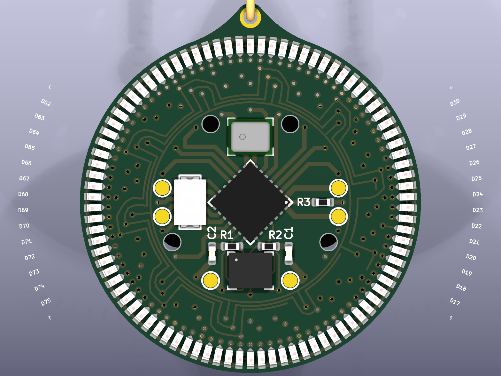

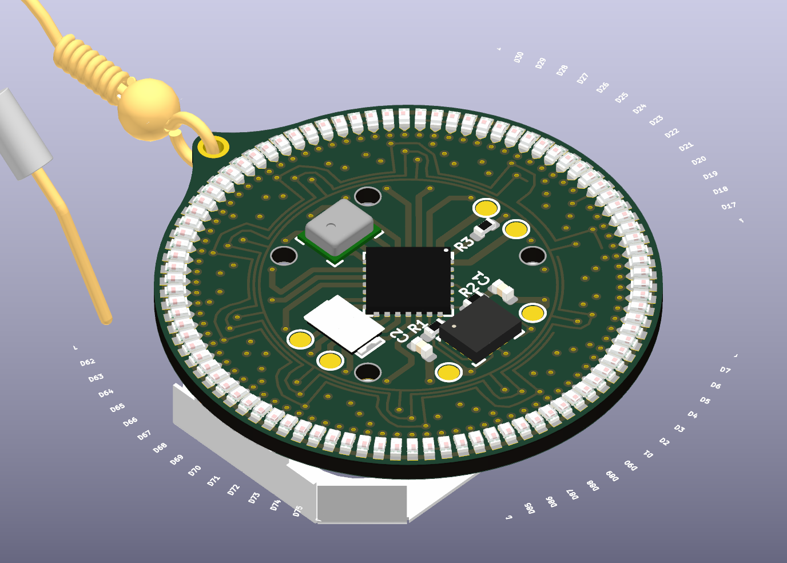

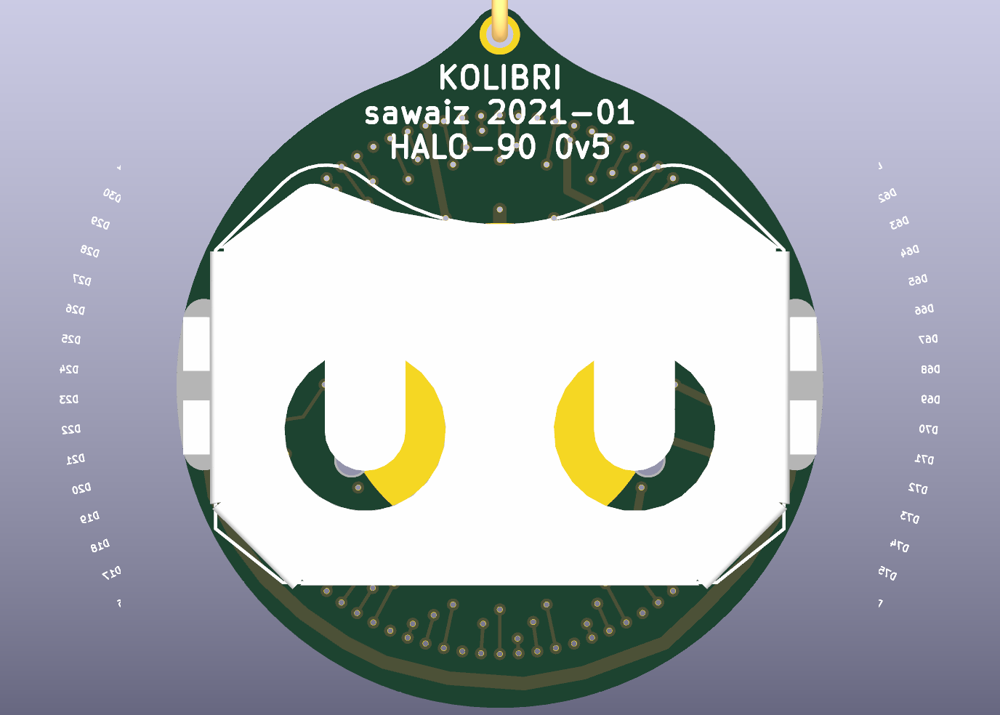

#### Copper layers (kicad-cli SVG → PNG)

| F.Cu | In1.Cu |
|:----:|:------:|
|  | 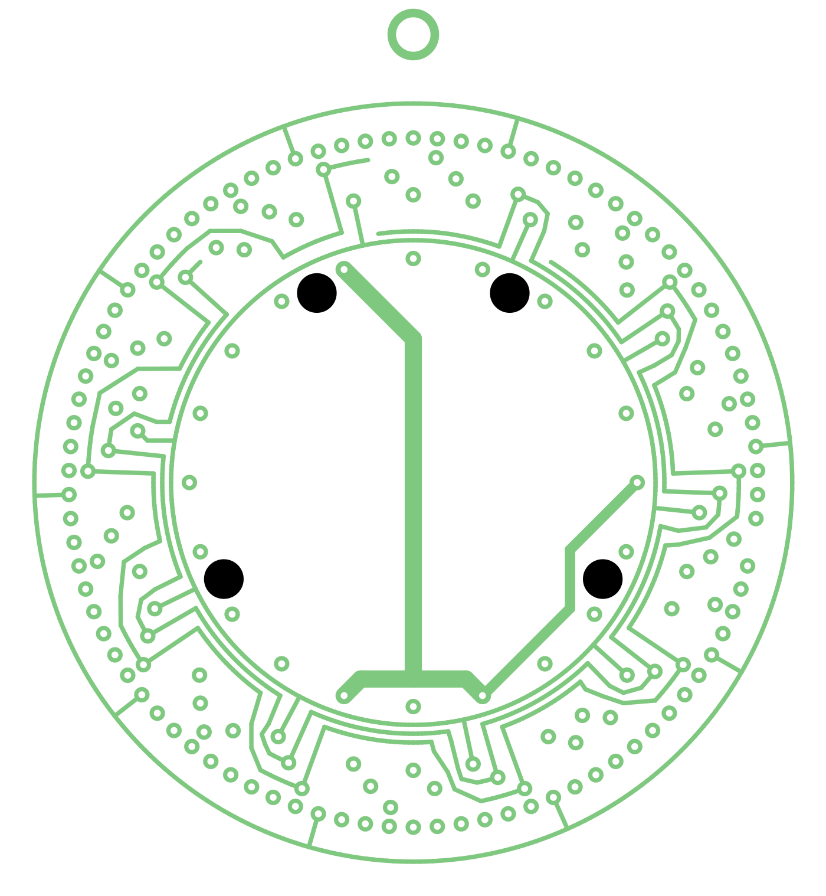 |

| In2.Cu | B.Cu |
|:------:|:----:|
| 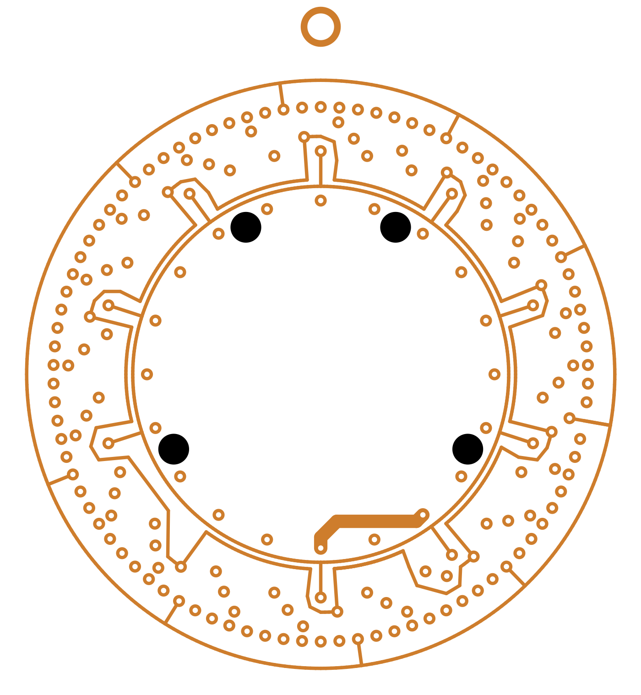 | 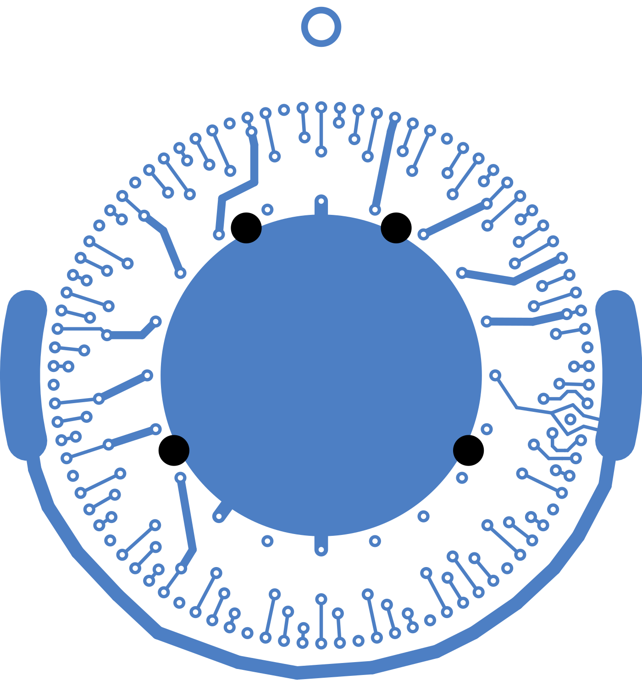 |

Direct pcbnew plots are also stored under `docs/images/kicad/pcbnew_*.svg`.

## Training data

See **[DATASETS.md](DATASETS.md)** for PCBench, Open Schematics, Gerbers, and conversion paths used to train or evaluate place/route models.

---

## References (selected)

For the complete annotated survey and bibliography, see **[RESEARCH.md](RESEARCH.md)**.

### Classical placement & routing

1. C. Y. Lee, “An algorithm for path connections and its applications,” *IRE Trans. Electronic Computers*, 1961.  
2. S. Kirkpatrick, C. D. Gelatt, M. P. Vecchi, “Optimization by simulated annealing,” *Science*, 1983.  
3. K. M. Hall, “An r-dimensional quadratic placement algorithm,” *Management Science*, 1970.  
4. S. Jain, H. C. Gea, “PCB Layout Design Using a Genetic Algorithm,” *J. Electronic Packaging*, 1996.  

### Topological / free-angle routing

5. T. Dayan, *Rubberband based topological router*, PhD thesis, UC Santa Cruz, 1997.  
6. W. W.-M. Dai, T. Dayan, D. Staepelaere, “Topological routing in SURF: generating a rubber-band sketch,” *DAC*, 1991.  
7. [TopoR](https://en.wikipedia.org/wiki/TopoR) (Eremex) — commercial topological free-angle autorouter.  
8. FreeRouting — open shape-based Specctra-compatible autorouter.  

### Congestion-aware & industrial PCB placement

9. C.-K. Cheng, C.-T. Ho, C. Holtz, “Net Separation-Oriented Printed Circuit Board Placement via Margin Maximization,” [arXiv:2210.14259](https://arxiv.org/abs/2210.14259), 2022 (**NS-Place**).  
10. T.-C. Lin et al., “A unified printed circuit board routing algorithm with complicated constraints and differential pairs,” *ASP-DAC*, 2021.  

### RL / ML for place & route

11. A. Mirhoseini, A. Goldie, et al., “A graph placement methodology for fast chip design,” *Nature*, 2021 ([arXiv:2004.10746](https://arxiv.org/abs/2004.10746)); Circuit Training / AlphaChip.  
12. P. Crocker, *Physically Constrained PCB Placement Using Deep Reinforcement Learning*, MIT, 2021.  
13. L. Vassallo, J. Bajada, “Learning Circuit Placement Techniques Through Reinforcement Learning with Adaptive Rewards,” *DATE*, 2024; [RL_PCB](https://github.com/LukeVassallo/RL_PCB).  
14. Y. He, *Towards automated PCB routing…*, PhD dissertation, Iowa State University, 2024 (DRL-MCTS, PCBench).  
15. Q. Xiang et al., multi-agent RL PCB routing, IEEE, 2024.  
16. Unet-Astar: deep learning-based fast routing for unified PCB routing, *IEEE Access*, ~2023.  
17. K. L. Lim et al., “Component Centric Placement Using Deep Reinforcement Learning,” [arXiv:2602.23540](https://arxiv.org/html/2602.23540v1), 2026.  
18. DreamerV3+FR: world-model RL + FreeRouting for PCB autorouting, *Expert Systems with Applications*, 2026.  
19. PCB-Bench: Benchmarking LLMs for PCB Placement and Routing, *ICLR*, 2026.  

### Datasets & physics tools

20. [PCBench](https://github.com/PCBench/PCBench) — KiCad routing dataset + RL environment.  
21. [Open Schematics](https://huggingface.co/datasets/bshada/open-schematics) — large public schematic/PCB corpus.  
22. [openEMS](https://docs.openems.de/) — open FDTD electromagnetic solver.  
23. Ngspice — open circuit simulator.  
24. KiCad — target open-source EDA host.

### Community / industry context

25. DeepPCB and similar products — RL-based commercial PCB routing at scale (multi-EDA, including KiCad).  
26. Practitioner reports of custom grid autorouters and hybrid human+tool flows when pure ML autorouters fail on dense high-speed interfaces (public engineering discussions on X and forums).  
27. Physics-aware commercial layout tools and agentic schematic→layout pipelines (e.g. Quilter-class, Flux, LLM + KiCad plugins)—strong for prototypes; expert review remains standard for SI/EMI-critical boards.
