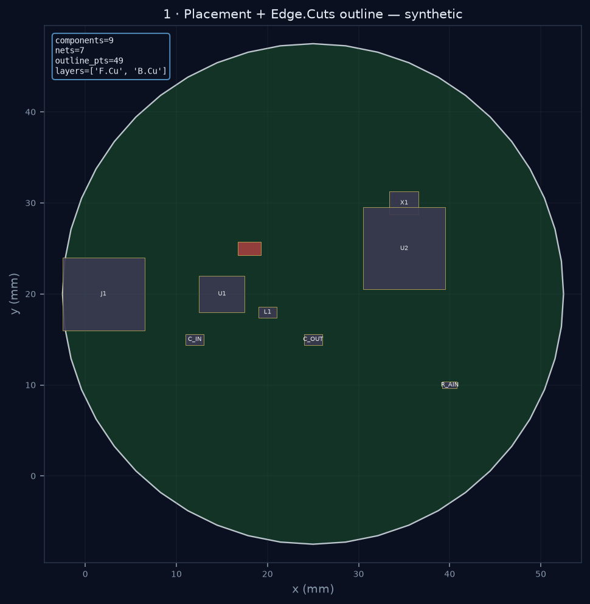
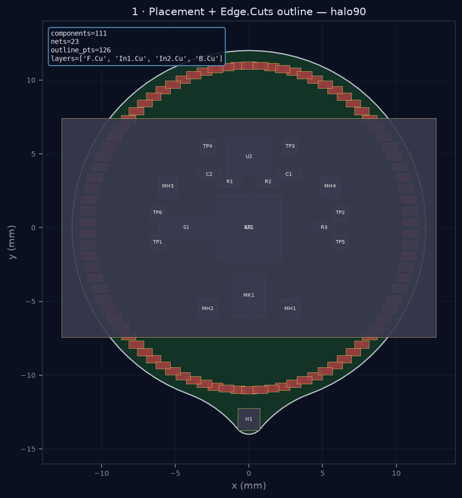
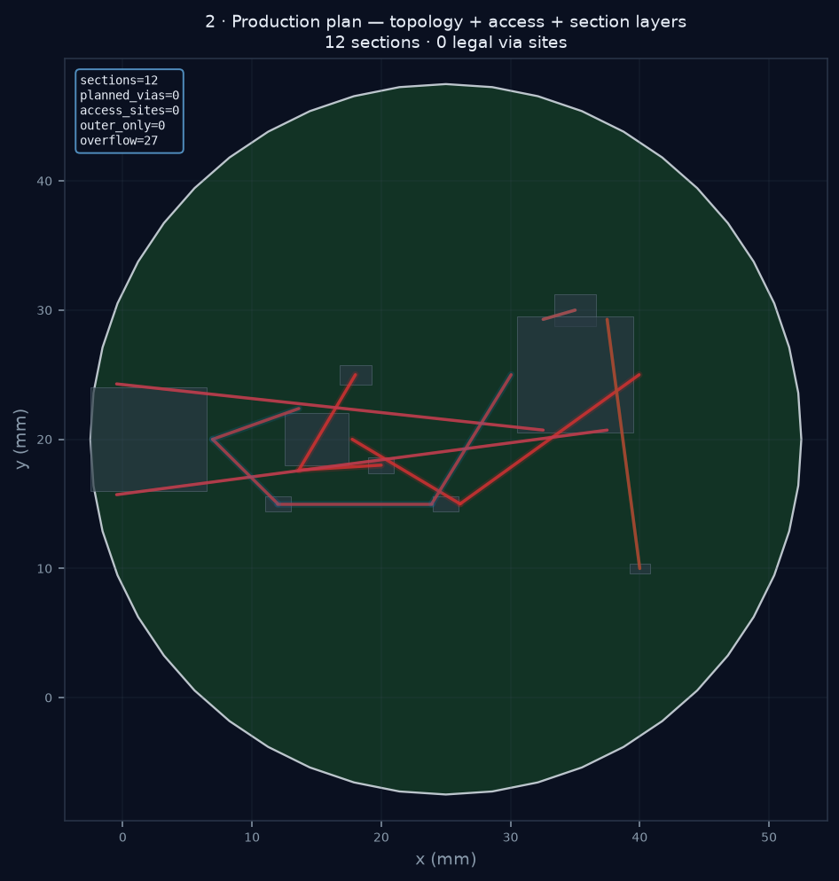
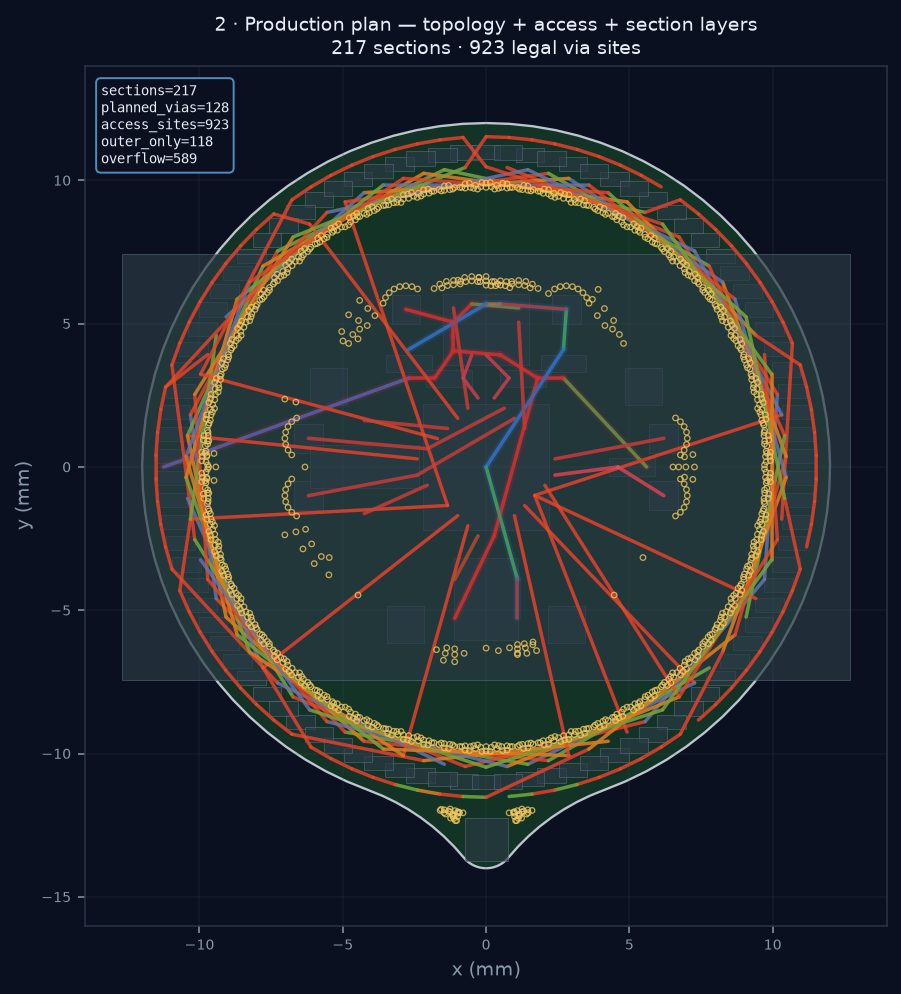
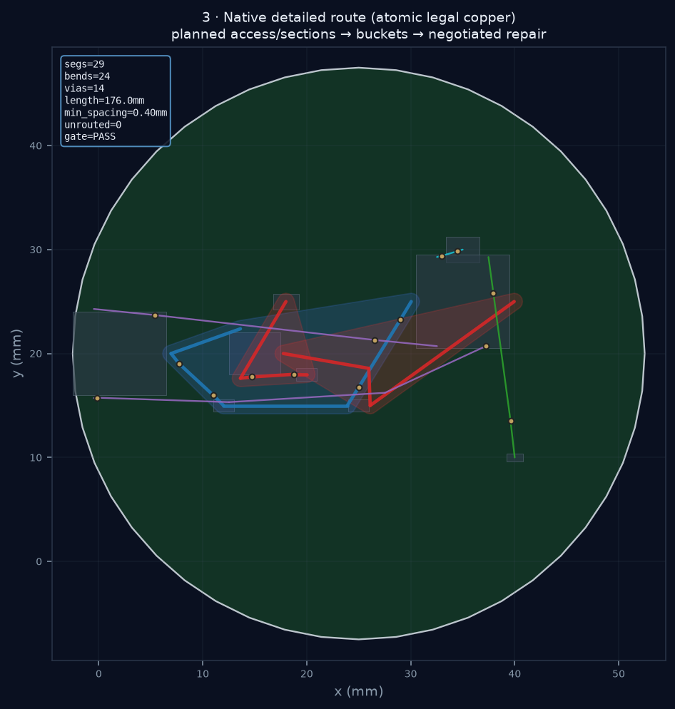
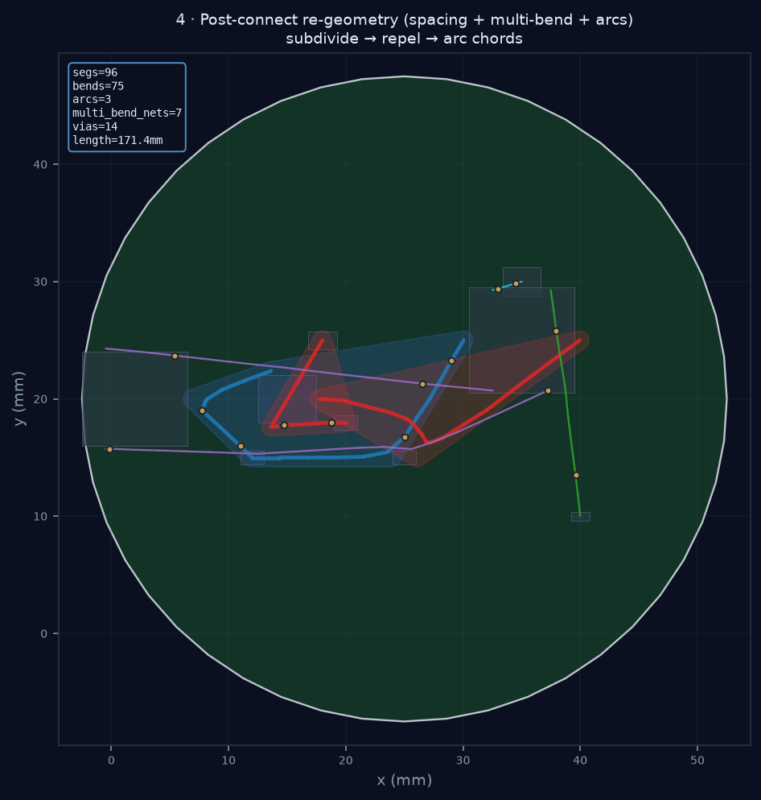
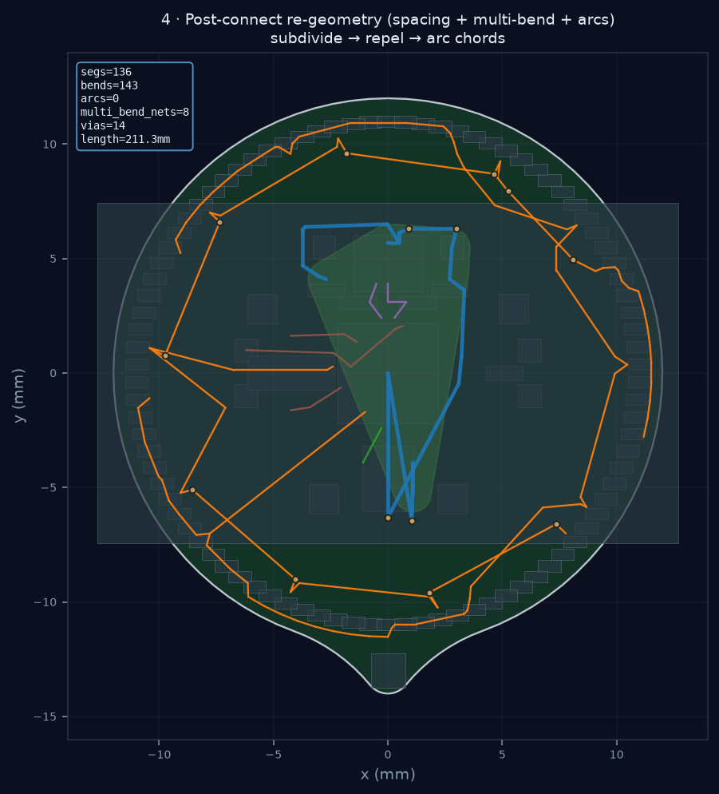
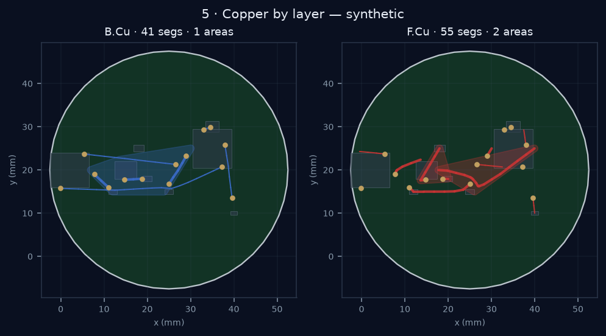
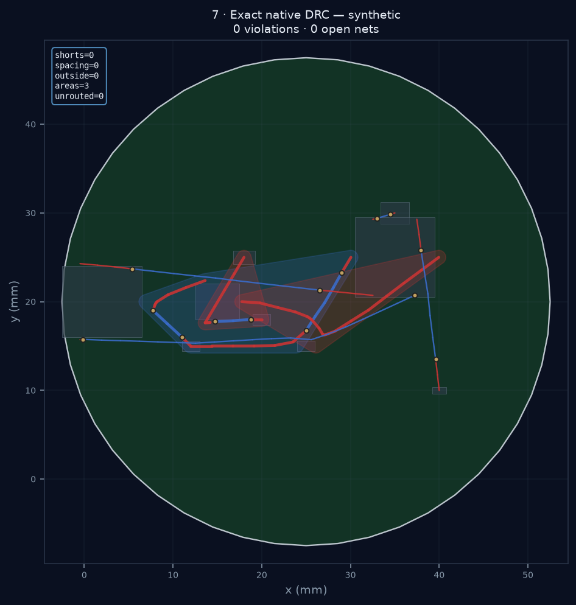

# physicsRouter

`physicsRouter` is a research PCB autorouter for KiCad. A required **C++ free-angle geometry core** (`pr_native`) does exact search and DRC; Python owns policy, capacity planning, KiCad I/O, validation, and the interactive control plane.

The goal is not a route that merely looks connected. A successful result needs physically reachable pads, explicit vias at layer transitions, complete multipin nets, **zero native hard violations**, and zero copper errors after KiCad applies the board.

> **Status (2026-07-19):** v2 production flow — pin-access preflight, **C++ capacity-mesh** section layer planning (tscircuit-inspired), atomic full-net commit, PathFinder congestion, conflict-directed rip-up. Synthetic boards pass DRC. **HALO-90** is still a dense stress case (legal partial routes preferred over shorts).

---

## Routing process (rendered)

Stages from placement through DRC, regenerated with the current native core:

| Stage | Synthetic demo | HALO-90 |
|-------|----------------|--------|
| Placement + outline |  |  |
| Guide topology |  |  |
| Clearance-aware copper |  |  |
| Re-geometry |  |  |
| By layer |  |  |
| Router DRC map |  |  |

**Process strip** (placement → guide → clearance → re-geometry):


**Placement / score overview**


Guide topology · copper by layer:


Regenerate:

```bash
python scripts/render_routing_process.py --halo
python scripts/generate_docs_images.py
```

---

## Speed & quality (this machine)

Host: **Apple M3**, OpenCL GPU, native `2.0.0-production-flow`.  
Artifacts: [`docs/images/routing_process/bench_latest.json`](docs/images/routing_process/bench_latest.json), [`docs/images/routing_process/drc_report.json`](docs/images/routing_process/drc_report.json).

| Workload | Time | Result |
|----------|-----:|--------|
| Synthetic native `route_board` | **3 ms** | 28 segs · 12 vias · capacity mesh depth 6 |
| Synthetic `clearance_aware_route` | **5 ms** | 29 segs · **0 shorts / 0 DRC** · 0 unrouted |
| Synthetic capacity mesh build | **6 ms** | 535 nodes · 862 edges |
| Synthetic capacity pipeline | **102 ms** | 22 segs · **0 shorts** · 0 unrouted |
| HALO-90 guide topology | **0.22 s** | 217 edges · 791 mm guide |
| HALO-90 clearance route (docs render) | **~150 s** | legal copper; multipin partials possible |
| HALO-90 native sequential (bench) | **27 s** | 199 segs · 20 vias · **0 shorts** · 8/23 nets fully ok · 239 mm |

### Render pipeline timings

| Board | Guide | Clearance | Re-geometry |
|-------|------:|----------:|------------:|
| Synthetic | 0.001 s | 1.3 s | 0.13 s |
| HALO-90 | 0.22 s | 150 s | 1.5 s |

### HALO honest status

| Metric | Latest bench |
|--------|----------------|
| Native DRC shorts / total viol | **0 / 0** on committed copper |
| Fully completed nets | **8 / 23** (atomic full-net policy) |
| Unrouted (open > short) | 15 |
| Length | ~239 mm |
| Vias | 20 |

Open nets are intentional under zero-violation commit — not a silent short dump. Dense CPX completion remains the open research goal. Historical failure analysis: [docs/AUTOROUTER_FAILURE_ANALYSIS.md](docs/AUTOROUTER_FAILURE_ANALYSIS.md).

---

## Tests

```bash
bash scripts/build_native.sh
PYTHONPATH=src:native/build pytest -q
```

| Suite | Result | Wall time |
|-------|--------|-----------|
| Full `tests/` | **199 passed** | ~133 s (M3) |
| Capacity mesh + native + hybrid | **27 passed** | ~106 s |
| Production pin-access / two-via | **passed** (host layer plan preserved) | <1 s |

---

## Current architecture

| Phase | Implementation |
|-------|----------------|
| Exact board model | Pad XY/rotation/layers, Edge.Cuts, fab rules, through vias |
| Pin-access oracle | Finite legal offset-via sites (`pin_access.py` + C++ checks) |
| Net hypergraph | Crossing-aware trees + DSATUR (`graph_theory.py`) |
| **Capacity mesh (C++)** | Hierarchical cells + section layer plan (`capacity_mesh.cpp`, [docs/CAPACITY_MESH.md](docs/CAPACITY_MESH.md)) |
| Detailed free-angle | ExactMap + GridMap isotropic search in `pr_native` |
| Atomic full-net commit | Partial stubs never paint |
| Negotiated congestion | PathFinder history + conflict-directed rip-up |
| Validation | Native DRC → KiCad DRC oracle |

```text
KiCad board + rules
        |
        v
pad model → pin-access sites → hypergraph topology
        |
        v
C++ capacity mesh → per-section layer assignment
        |
        v
detailed free-angle (atomic nets, real vias)
        |
        v
native DRC → optional KiCad DRC → score
```

Ideas adapted from the MIT [tscircuit capacity-autorouter](https://github.com/tscircuit/tscircuit-autorouter) (mesh, depth, step pipeline) — **implemented in C++**, not as a TypeScript dependency.

---

## Definition of working

A route may be selected as “best” only when:

1. Every required pad is in the correct multilayer connected component.
2. Rejected nets leave **no** partial copper.
3. Every layer transition has a legal via.
4. Native DRC reports **zero** hard violations.
5. Applied KiCad copper reports zero copper DRC errors (when checked).
6. Viewer, score, and API expose the same metrics.
7. Source commit, native version, rules, seed, and wall time are recorded.

---

## Quick start

```bash
python3 -m venv .venv && source .venv/bin/activate
pip install -e ".[dev]"
bash scripts/build_native.sh
python -c "from physics_router.native_bridge import info; print(info())"

# Control plane (HALO-90 if cloned; or PHYSICS_ROUTER_PRESET=physics)
physics-router serve --host 127.0.0.1 --port 8765

pytest -q
python scripts/ci_regression.py
```

### CLI

```bash
physics-router import-nets --pcb board.kicad_pcb -o placement_config.yaml
physics-router route --config placement_config.yaml --pcb board.kicad_pcb \
  --pipeline capacity --effort 0.55 --out route.json --out-pcb routed.kicad_pcb --drc
```

### Presets

| Preset | Board |
|--------|--------|
| `halo-90` | Wearable charlieplex stress board (`third_party/halo-90`) |
| `physics` | Muon3 telescope (`../physics` v10 layout, `examples/physics/`) |
| `synthetic` | Built-in demo_buck |

The 2D viewer substrate follows **loaded Edge.Cuts** (rectangle or ring) — not a hard-coded HALO circle.

---

## Repository map

| Path | Role |
|------|------|
| `native/` | C++ ExactMap, free-angle search, **capacity mesh**, DRC |
| `src/physics_router/capacity_mesh.py` | Mesh API (prefers C++) |
| `src/physics_router/route_pipeline.py` | Step pipeline: access → mesh → detail → gate |
| `src/physics_router/global_router.py` | Section layer negotiation |
| `src/physics_router/pin_access.py` | Offset-via preflight |
| `src/physics_router/hybrid_route.py` | Multi-strategy free-angle buckets |
| `src/physics_router/router.py` | Orchestration, sequential zero-violation policy |
| `viewer/` + `server.py` | Local UI / API |
| `examples/halo-90/` · `examples/physics/` | Board configs + benches |

## Documentation

- [Capacity mesh (C++ / tscircuit-inspired)](docs/CAPACITY_MESH.md)
- [Failure analysis](docs/AUTOROUTER_FAILURE_ANALYSIS.md)
- [Design decisions](DESIGN.md)
- [Topology-first architecture](docs/ARCHITECTURE_ROUTER.md)
- [TopoR research](docs/TOPOR.md)
- [Hybrid routing](docs/HYBRID_ROUTING.md)
- [JLCPCB rules](docs/JLCPCB_4LAYER.md)
- [Native core](native/README.md)
- [Research bibliography](RESEARCH.md)

## Requirements and license

- Python 3.10+
- CMake 3.16+ / C++17
- KiCad 8+ (`kicad-cli`) for authoritative DRC
- Optional: OpenMP, OpenCL, Ngspice, OpenEMS

MIT. HALO-90 and other product boards are separate projects under `third_party/` or sibling repos.
