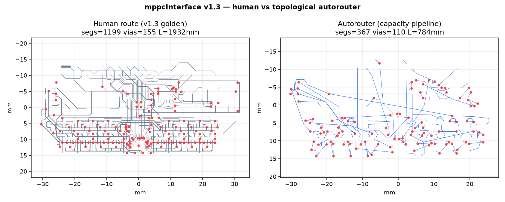
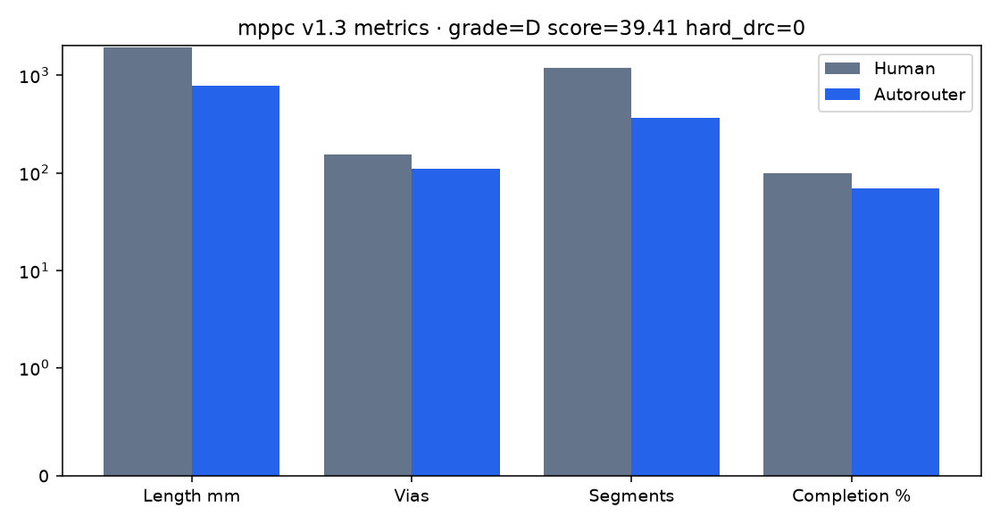
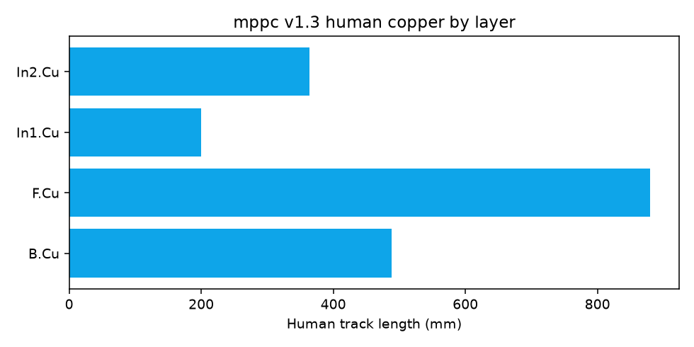

# physicsRouter

**Tested topological autorouting for KiCad.**

Plan connectivity as graph topology, then draw free-angle copper with exact clearance.
**Open nets beat illegal copper** — a partial legal route is success; pretty tracks that short are failure.

```text
.kicad_pcb
    → model + nets
    → via profile · pin access · overflow Steiner · cut preflight
    → capacity mesh · PathFinder-style sections
    → free-angle copper (C++ ExactMap)
    → manufacturing gate (full multipin nets · 0 hard DRC)
    → optional SPICE / OpenEMS  (only after fully legal copper)
    → re-place / re-topo / pours
```

| | |
|---|---|
| **What it is** | Research/engineering autorouter for multipin, multilayer PCBs |
| **Geometry** | Free-angle (TopoR-class idea) via required C++ core `pr_native` |
| **Planning** | Hypergraph MST · overflow Steiner · DSATUR layers · capacity mesh |
| **Product** | Python CLI · web UI · KiCad I/O · net policy · DRC · golden suite |
| **Success** | Reachable pads · real vias · full multipin nets · **0 hard DRC** |
| **Not success** | Tracks that short, stub, or only “look” finished |

---

## Flagship benchmark: mppcInterface v1.3

**Primary golden board** — HEP SiPM/MPPC readout from
[muonTelescope/mppcInterface](https://github.com/muonTelescope/mppcInterface)
@ commit **`580c61d`** (*Initial update to 1.3*).

This is a complete **4-layer human route** (not HEAD’s later 2-layer tree with unroutes).
Upstream design notes cite **sPHENIX-class** bias and coincidence topologies.
It is the board physicsRouter optimizes against: dense multipin, mixed HV/analog/digital/power,
and a fair manufacturing-style score (rip human copper → re-route → grade).

### Human golden (oracle)

| | Value |
|---|------:|
| Outline | **65 × 30 mm** |
| Parts / nets | **161 / 85** (all nets have copper) |
| Layers | F.Cu · In1.Cu · In2.Cu · B.Cu |
| Segments · vias · pours | **1199 · 155 · 61** |
| Track length | **1931.8 mm** |
| Topology guide (AR planner) | ~1563 mm · **60** Steiner multipin nets |
| Cut preflight | feasible (0 saturated cuts @ 0.3 mm pitch, 4 layers) |
| Via profile (auto) | `via_0p6` · ~99% SMD escape reach · shared-escape savings ~19% |

### Latest AR scorecard (capacity · effort 0.45 · ~28 min)

| Metric | Human | Autorouter |
|--------|------:|-----------:|
| Grade / score | — | **F / 18.24** |
| Completion vs human nets | 100% | **48.2%** (41/85) |
| Hard DRC | 0 | **0** (open > short) |
| Segments · vias · length | 1199 · 155 · 1932 mm | 318 · 94 · 805 mm |
| Areas / pours | 61 | 3 |
| Wall time | hand | ~1500 s search |

Honest partial: committed copper is legal; power/GND, analog channels, and SPI bus nets remain open.
Missing include `GND`, `+5V`, `+3V3`, `CH0`–`CH7`, `HV`, FPGA SPI, DACs — pour-heavy multipin work still to do.

**Why F / how to improve:** [docs/ROUTING_DIFFICULTIES.md](docs/ROUTING_DIFFICULTIES.md) ·
auto logs `route_diagnostics.{json,md}` on every golden-eval ·
mppc snapshot [docs/mppc_v13_route_diagnostics.md](docs/mppc_v13_route_diagnostics.md).

Pinned PCB + config: [`examples/mppc-interface/`](examples/mppc-interface/)  
Full write-up: **[docs/MPPC_BENCHMARK.md](docs/MPPC_BENCHMARK.md)** · artifacts `viewer/runs/mppc_v1.3/`







### Score policy

| Rule | Meaning |
|------|---------|
| Completion | Fraction of **human** nets the AR fully commits |
| Hard DRC | Must stay **0** on committed copper |
| Open > short | Incomplete net with empty copper beats illegal stubs |
| Length / vias | Secondary; shorter length with open nets is **not** better |
| Physics | SPICE / OpenEMS proxies only **after** complete + legal copper |

```bash
# Reproduce the flagship run
bash scripts/build_native.sh
python scripts/run_mppc_benchmark.py

# Or explicit capacity pipeline
physics-router route \
  --pcb examples/mppc-interface/mppcInterface_v1.3.kicad_pcb \
  --config examples/mppc-interface/placement_config.yaml \
  --pipeline capacity --effort 0.5 \
  --out-json /tmp/mppc_ar.json --out-pcb /tmp/mppc_ar.kicad_pcb

physics-router golden-eval --manifest examples/mppc-interface/manifest.yaml
```

Artifacts land under `viewer/runs/mppc_v1.3/` (`human_route.json`, topology, pin-access, benchmark row).

---

## Why this project exists

Commercial and open autorouters often optimize for **looks** or grid paths and then fail hard DRC
on dense multipin boards (charlieplex LEDs, HEP front-ends, crowded OHL instruments).
physicsRouter is built to answer a narrower question:

> Can we plan **topology** (what connects, on which layers, through which corridors),
> then emit **clearance-legal free-angle copper**, and prove progress against **real human goldens**?

Inspiration and literature (not a clone of any proprietary engine):

- **TopoR / Dayan–Dai rubber-band** — topology before geometry; free angles  
- **PathFinder** — negotiated congestion / history costs  
- **TritonRoute-style pin access** — legal escapes before global pathing  
- **Capacity mesh** (tscircuit-class idea in C++) — where is room before paint  
- **Steiner packing · cut certificates · DSATUR** — graph plane before A\*  

See [RESEARCH.md](RESEARCH.md) · [docs/TOPOR.md](docs/TOPOR.md) · [DESIGN.md](DESIGN.md).

---

## Architecture

```text
┌─────────────────────────────────────────────────────────────┐
│  CLI · HTTP server · web viewer · KiCad plugin (Python)     │
│  config · jobs · import · export · DRC/ERC · OpenEMS        │
└────────────────────────────┬────────────────────────────────┘
                             │
     ┌───────────────────────┼───────────────────────┐
     ▼                       ▼                       ▼
 placement / physics    route_pipeline          kicad_io / tools
 net_import / rules     pin_access / hybrid     design_rules
 graph_theory / golden  negotiated congestion   physics_feedback
     │                       │
     │                       ▼
     │                 pr_native (C++17)
     │                 ExactMap · free-angle · capacity mesh · native DRC
     ▼
  Ngspice / OpenEMS proxies  (optional, post-legal only)
```

| Layer | Owns |
|-------|------|
| **Python** | Policy, UI, files, jobs, net labels, golden-eval, graph topology |
| **C++ `pr_native`** | Clearance map, free-angle search, capacity mesh, native DRC |
| **KiCad** | Authoritative DRC/ERC, STEP/GLB, official plots |

### Capacity / production pipeline

```text
via_profile → pin_access → topology_mesh → global_sections
          → detailed free-angle → manufacturing_gate
          → (optional) physics_feedback → re-place / pours
```

| Stage | What it does |
|-------|----------------|
| **Via profile** | Auto-select `via_0p6` vs `via_0p45` by pad escape reachability |
| **Pin access** | Legal offset vias; **shared-escape** resource map (charge co-located sites once) |
| **Topology** | Hypergraph MST · **overflow-aware Steiner** · annular multipin · DSATUR layers |
| **Cut preflight** | Geometric demand vs capacity certificates (saturated cuts ⇒ replan signal) |
| **Global sections** | Hierarchical capacity mesh · PathFinder history · shared via charge |
| **Detail** | C++ ExactMap free-angle search (no illegal straight fallbacks) |
| **Gate** | Full multipin connectivity + **0** native hard DRC; whole-net commit only |
| **Physics** | SPICE + OpenEMS **after** legal complete copper → feed place/topo/route/pours |

Modules: `pin_access` · `graph_theory` · `capacity_mesh` · `global_router` · `route_pipeline` · `router` · `physics_feedback` · `golden_eval`.

---

## What “good” means

1. Every pad of a **committed** net is multilayer-connected  
2. Failed nets leave **no** stubs (open > short)  
3. Layer changes use **real** rule-sized vias (not point vias)  
4. Native DRC: **zero** hard violations  
5. Prefer KiCad copper DRC on the applied board  
6. Optional: SPICE / OpenEMS proxies **after** (1–5), never instead of them  

---

## Benchmarks & galleries

### 1. mppcInterface v1.3 (HEP — primary)

See top of this page · [docs/MPPC_BENCHMARK.md](docs/MPPC_BENCHMARK.md) · [examples/mppc-interface/](examples/mppc-interface/)

### 2. OHL / open-hardware suite

Rip-and-reroute vs original human copper on CERN-OHL and public demos.
Policy: open > short; hard DRC = 0 on committed copper.


| Board | License | Latest gallery |
|-------|---------|----------------|
| `simple_2net` | fixture | **A** · 100% · 0 DRC |
| `ecc83_pp` / `_v2` | KiCad demo | **A** · 100% · 0 DRC |
| `ofm_illumination` | CERN-OHL | D · 50% · 0 DRC (honest partial) |
| `openflexure_illum` | CERN-OHL-S | F · 25% · 0 DRC (pour-heavy) |
| `pic_programmer` / dense OHL | KiCad / CERN-OHL | 0% or TIMEOUT under hard deadline |

Full table + per-board copper plots (human left · AR right):
**[examples/golden/RESULTS.md](examples/golden/RESULTS.md)** · [examples/golden/README.md](examples/golden/README.md) · [examples/golden/SOURCES.md](examples/golden/SOURCES.md)

```bash
bash scripts/fetch_golden_boards.sh
python scripts/run_ohl_golden_gallery.py --effort 0.45
physics-router golden-eval --manifest examples/golden/ci_manifest.yaml
```

### 3. HALO-90 (dense charlieplex stress)

In-repo LED earring board: **zero-violation partials by design**.
Dense CPX remains an open research stress case.

[examples/halo-90/](examples/halo-90/) · [docs/AUTOROUTER_FAILURE_ANALYSIS.md](docs/AUTOROUTER_FAILURE_ANALYSIS.md)

### 4. Corpus charts


More: [docs/GOLDEN_CORPUS.md](docs/GOLDEN_CORPUS.md) · [docs/BENCHMARKS.md](docs/BENCHMARKS.md)

### 5. Routing process (visual)


| Stage | Module |
|-------|--------|
| Pad / zone / Edge.Cuts | `kicad_io` |
| Pin-access + shared escapes | `pin_access` |
| Overflow Steiner + cuts | `graph_theory` |
| Capacity mesh + sections | `capacity_mesh` · `global_router` · C++ |
| Free-angle copper | `pr_native` ExactMap |
| Atomic full-net commit | `router` / hybrid policy |
| Physics feedback | `physics_feedback` (SPICE · OpenEMS proxies) |
| Oracle | KiCad `kicad-cli` DRC |

---

## 60-second start

```bash
python3 -m venv .venv && source .venv/bin/activate
pip install -e ".[dev]"
bash scripts/build_native.sh

# Interactive UI
physics-router serve --port 8765   # http://127.0.0.1:8765

# Headless any board
physics-router smoke --pcb path/to/board.kicad_pcb --fail-on-drc

# Flagship golden
python scripts/run_mppc_benchmark.py

# Tests (native required for full collection)
pytest -q
```

Verify the C++ core:

```bash
python -c "from physics_router.native_bridge import info; print(info())"
# expect: available=True, version ~ 2.0.0-production-flow
```

| Need | |
|------|---|
| Python **3.10+** | required |
| CMake **3.16+**, C++17 | required for `pr_native` |
| KiCad **8+** (`kicad-cli`) | authoritative DRC / plots |
| OpenCL · Ngspice · OpenEMS | optional |

Guides: [docs/QUICKSTART.md](docs/QUICKSTART.md) · [docs/USER_GUIDE.md](docs/USER_GUIDE.md) · [docs/CLI.md](docs/CLI.md)

---

## How to use

| Path | When | Command |
|------|------|---------|
| **Viewer** | Import, lock nets, re-route, 3D | `physics-router serve` |
| **CLI** | Scripts / CI | `smoke` · `route` · `golden-eval` · `improve` · `drc` |
| **Plugin** | Inside pcbnew | [kicad_plugins/](kicad_plugins/README.md) |

```bash
# Capacity / topological pipeline
physics-router route --pcb board.kicad_pcb \
  --pipeline capacity --effort 0.55 \
  --out-json route.json --out-pcb routed.kicad_pcb --fail-on-drc

# Score vs human copper (rip-and-reroute)
physics-router golden-eval --manifest examples/mppc-interface/manifest.yaml
physics-router golden-eval --manifest examples/golden/ci_manifest.yaml

# Place + route + physics feedback (only meaningful after full legal copper)
physics-router improve --config placement_config.yaml --pcb board.kicad_pcb \
  --timeout 180 --grade B --physics-feedback

# FreeRouting baseline interchange
physics-router export-dsn --pcb board.kicad_pcb -o board.dsn
```

Net policy / placement configs are YAML (`examples/*/placement_config.yaml`).
Without a config, nets auto-import from the PCB (and schematic when present).

---

## Graph theory plane (what is new)

Before geometric search, the board is a **hypergraph**: one vertex per pad anchor,
one hyperedge per multipin net.

| Feature | Role |
|---------|------|
| Kruskal / Prim trees | Length + projected-crossing preference for guides |
| **Overflow-aware Steiner** | Extra Steiner candidates under occupancy pressure |
| DSATUR coloring | Layer assignment on the net conflict graph |
| **Cut-capacity preflight** | Demand vs capacity certificates before detail route |
| Shared-escape map | Multipin pin-access sites charged once per cluster |
| Auto via profile | 0.60 vs 0.45 mm by measured escape reachability |
| Post-route audit | Cycles, crossings, articulations, bridges, layer usage |

This separates **topological intent** from **geometric legality**. Both are inspectable
in route quality / topology JSON.

---

## Physics feedback (when it runs)

OpenEMS and SPICE are **not** used to score partial illegal copper.
They run only after a route is **electrically complete** and **hard-DRC clean**:

1. Manufacturing gate passes  
2. Optional `improve --physics-feedback` (or continuous-improve stage)  
3. Proxies (loop area, critical nets, emission heuristics, Ngspice where available)  
4. Results feed re-placement, re-topology, routing priorities, and pour growth  

Module: `physics_feedback.py` · tests: `tests/test_physics_feedback.py`.

---

## Repo map

| Path | Role |
|------|------|
| [`src/physics_router/`](src/physics_router/) | CLI, server, policy, planning, golden-eval, graph theory |
| [`native/`](native/) | C++ ExactMap · capacity mesh · pybind (`pr_native`) |
| [`examples/mppc-interface/`](examples/mppc-interface/) | **Primary golden** — pinned v1.3 4L PCB |
| [`examples/golden/`](examples/golden/) | OHL suite · RESULTS · manifests · SOURCES |
| [`examples/halo-90/`](examples/halo-90/) | Dense multipin stress |
| [`examples/demo/`](examples/demo/) | Synthetic demo · FreeRouting interchange |
| [`docs/`](docs/) | Guides · benches · architecture · image galleries |
| [`scripts/`](scripts/) | Build native · mppc / OHL gallery · fetch goldens · CI |
| [`tests/`](tests/) | Unit + golden + graph + physics + native |
| [`kicad_plugins/`](kicad_plugins/) | pcbnew action plugin |
| [`viewer/`](viewer/) | Web UI assets · run artifacts |
| [`third_party/`](third_party/) | Fetched golden boards (see fetch script) |

---

## Status

| Area | State |
|------|--------|
| Package | **0.1.0** · native `2.0.0-production-flow` |
| Tests | `pytest -q` (extensive; native required for full collection) |
| Synthetic / simple boards | Full route + 0 DRC typical |
| mppc v1.3 | Human golden complete; AR **48% / 0 hard DRC / grade F** (~28 min capacity, open > short) |
| OHL gallery | Easy boards A / honest partial; dense often hard-deadline TIMEOUT |
| HALO-90 | Legal partials; dense CPX still open research |
| Physics loop | SPICE/OpenEMS after complete legal copper only |
| Non-goals today | Guaranteed 100% on every dense board; fab sign-off without human/KiCad review |

---

## Documentation

| Doc | Content |
|-----|---------|
| [docs/MPPC_BENCHMARK.md](docs/MPPC_BENCHMARK.md) | **Flagship human vs AR report** |
| [examples/golden/RESULTS.md](examples/golden/RESULTS.md) | OHL gallery table + copper plots |
| [docs/GOLDEN_CORPUS.md](docs/GOLDEN_CORPUS.md) | Corpus metrics + physics notes |
| [docs/CAPACITY_MESH.md](docs/CAPACITY_MESH.md) | Pipeline stages |
| [docs/ARCHITECTURE_ROUTER.md](docs/ARCHITECTURE_ROUTER.md) | Router architecture depth |
| [DESIGN.md](DESIGN.md) | Architecture decisions · open > short |
| [RESEARCH.md](RESEARCH.md) | Papers · graph theory · TopoR map |
| [docs/TOPOR.md](docs/TOPOR.md) | Commercial TopoR product reference |
| [docs/CLI.md](docs/CLI.md) | Full CLI reference |
| [docs/USER_GUIDE.md](docs/USER_GUIDE.md) | Day-to-day UI / workflows |
| [docs/QUICKSTART.md](docs/QUICKSTART.md) | Install in minutes |
| [docs/AUTOROUTER_FAILURE_ANALYSIS.md](docs/AUTOROUTER_FAILURE_ANALYSIS.md) | HALO failure lessons |
| [docs/README.md](docs/README.md) | Full doc index |
| [DATASETS.md](DATASETS.md) | Board inventory |

---

## Requirements · license

- Python **3.10+**, CMake **3.16+**, C++17  
- KiCad **8+** (`kicad-cli`) for authoritative DRC  
- Optional: OpenCL, Ngspice, OpenEMS  

**MIT** for physicsRouter.

Third-party boards (mppcInterface, HALO-90, OHL clones under `third_party/`) keep their own licenses —
see [examples/golden/SOURCES.md](examples/golden/SOURCES.md). Always record the upstream git SHA when publishing benchmarks.
