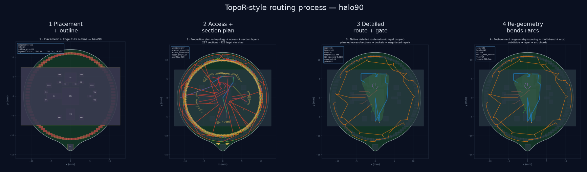

# physicsRouter

**KiCad autorouter that prefers open nets over illegal copper.**

| | |
|---|---|
| **What it is** | Free-angle PCB router for KiCad (TopoR-style geometry + capacity-mesh planning) |
| **Who owns geometry** | Required C++ core `pr_native` (ExactMap + free-angle search) |
| **Who owns product** | Python: CLI, web UI, net policy, KiCad I/O, DRC |
| **Success means** | Reachable pads · real vias · complete multipin nets · **0 hard DRC** |
| **Not success** | Pretty tracks that short, leave stubs, or only “look” finished |

```text
Load board → plan (pin-access + capacity mesh) → free-angle copper
         → native DRC → write .kicad_pcb → optional KiCad DRC
```

---

## 60-second start

```bash
python3 -m venv .venv && source .venv/bin/activate
pip install -e ".[dev]"
bash scripts/build_native.sh

# A) Web UI — drop any .kicad_pcb
physics-router serve --port 8765
# open http://127.0.0.1:8765

# B) One board, headless (CI-friendly)
physics-router smoke --pcb path/to/board.kicad_pcb --fail-on-drc

# C) Tests
pytest -q
```

Need more detail? → **[docs/QUICKSTART.md](docs/QUICKSTART.md)**  
Full how-to? → **[docs/USER_GUIDE.md](docs/USER_GUIDE.md)**  
All docs map? → **[docs/README.md](docs/README.md)**

---

## Three ways to use it

| Path | When | Command / UI |
|------|------|----------------|
| **1. Viewer** | Interactive: import, lock nets, re-route, 3D | `physics-router serve` → Board → Route → Check |
| **2. CLI** | Scripts / CI | `smoke`, `route`, `drc`, `export-dsn` |
| **3. KiCad plugin** | Inside pcbnew | [kicad_plugins/](kicad_plugins/README.md) |

**Viewer flow:** drop a `.kicad_pcb` (or pick HALO / Muon3) → **Route** → optionally lock nets / keep-outs → **Apply to PCB** → **Check** DRC.  
OpenEMS / heavy 3D is gated until the route is decent (grade ≥ C, no hard violations).

---

## What “good” looks like

A route is trusted only if:

1. Every pad of a committed net is multilayer-connected  
2. Failed nets leave **no** partial copper (open > short)  
3. Layer changes use real vias  
4. Native DRC: **zero** hard violations  
5. KiCad copper DRC clean when you run it  

Dense boards (e.g. HALO-90) may finish only a subset of nets under that policy — by design.

---

## Routing at a glance



| Stage | Module |
|-------|--------|
| Pad / zone / Edge.Cuts model | `kicad_io` |
| Pin-access (BGA/QFN denser) | `pin_access` |
| Capacity mesh + layers | C++ `capacity_mesh` + `route_pipeline` |
| Free-angle copper | `pr_native` ExactMap |
| Atomic full-net commit | sequential policy in `router` |
| Oracle | KiCad `kicad-cli` DRC |

More pictures: [docs/images/routing_process/](docs/images/routing_process/README.md)

---

## CLI cheatsheet

```bash
# Any board — auto-import nets, route, write PCB, fail on DRC
physics-router smoke --pcb board.kicad_pcb --fail-on-drc --min-grade D

# Full control
physics-router route --pcb board.kicad_pcb \
  --pipeline capacity --effort 0.55 \
  --out-json route.json --out-pcb routed.kicad_pcb \
  --fail-on-drc --fail-on-unrouted

# Labels from KiCad
physics-router import-nets --pcb board.kicad_pcb -o placement_config.yaml

# Golden suite: rip human copper → autoroute → score vs human
physics-router golden-eval --manifest examples/golden/manifest.yaml
physics-router golden-eval --id simple_2net --extract-only

# FreeRouting baseline
physics-router export-dsn --pcb board.kicad_pcb -o board.dsn
physics-router import-ses --ses board.ses --pcb board.kicad_pcb -o board_fr.kicad_pcb

physics-router --help   # full command list
```

---

## Repo map (where to look)

| Path | Role |
|------|------|
| [`src/physics_router/`](src/physics_router/) | Python product (CLI, server, policy, I/O) |
| [`native/`](native/) | C++ geometry core — [native/README.md](native/README.md) |
| [`viewer/`](viewer/) | Web UI |
| [`kicad_plugins/`](kicad_plugins/) | pcbnew ActionPlugin |
| [`examples/`](examples/) | HALO-90, Muon3 / physics, synthetic configs |
| [`docs/`](docs/) | Guides, architecture, benches, images |
| [`tests/`](tests/) | ~209 pytest cases |

---

## Status snapshot

- **Version:** 0.2.0 · native `2.0.0-production-flow`  
- **Tests:** `pytest -q` (~209+ collected)  
- **Synthetic:** typically full route + 0 DRC  
- **HALO-90:** zero-violation **partial** OK (open nets > shorts); dense CPX still hard  
- **Golden corpus:** CERN WREN, OpenIPMC, SatNOGS, Jetson, KiCad demos — [docs/GOLDEN_CORPUS.md](docs/GOLDEN_CORPUS.md)

Benches & gallery: [docs/BENCHMARKS.md](docs/BENCHMARKS.md)

---

## Documentation

| Doc | Read when you want… |
|-----|---------------------|
| [docs/README.md](docs/README.md) | **Map of every doc** |
| [docs/QUICKSTART.md](docs/QUICKSTART.md) | Install + first route |
| [docs/USER_GUIDE.md](docs/USER_GUIDE.md) | Viewer, CLI, plugin, API |
| [docs/CLI.md](docs/CLI.md) | Every CLI command |
| [DESIGN.md](DESIGN.md) | Why the architecture is this way |
| [docs/CAPACITY_MESH.md](docs/CAPACITY_MESH.md) | Capacity-mesh pipeline |
| [native/README.md](native/README.md) | C++ core build & flags |
| [docs/ARCHITECTURE_ROUTER.md](docs/ARCHITECTURE_ROUTER.md) | Topology → geometry pipeline |
| [RESEARCH.md](RESEARCH.md) | Literature / TopoR context |

---

## Requirements · license

- Python **3.10+**, CMake **3.16+**, C++17  
- KiCad **8+** (`kicad-cli`) for authoritative DRC  
- Optional: OpenCL / OpenMP, Ngspice, OpenEMS  

**MIT.** Product boards under `third_party/` or sibling repos keep their own licenses.
