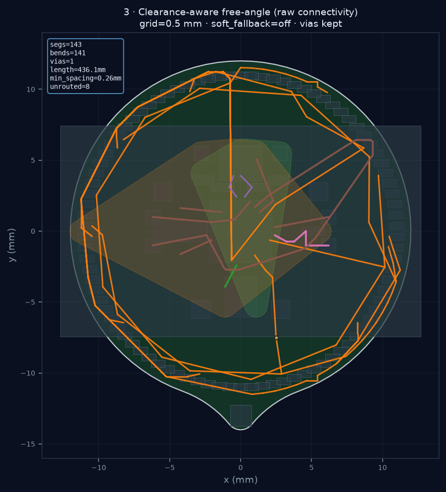
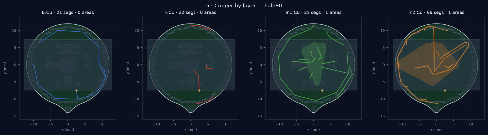
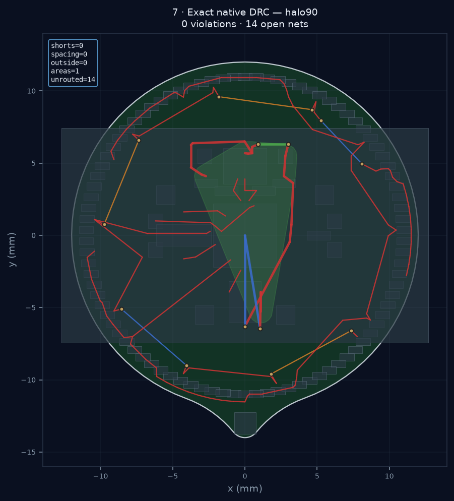

# physicsRouter

Physics-aware **KiCad placement and TopoR-style free-angle routing** with closed-loop **DRC/ERC**, an interactive control plane, and a required **C++/OpenCL** router core (the only geometric router — no Python fallback).

Inspired by [TopoR](https://en.wikipedia.org/wiki/TopoR) / [Eremex TopoR](https://www.eremex.com/products/topor/) (gridless free-angle topology) and multi-objective placement research that scores **post-route and physical** quality, not HPWL alone.

| Doc | Contents |
|-----|----------|
| **[DESIGN.md](DESIGN.md)** | Architecture, design decisions, future work |
| **[RESEARCH.md](RESEARCH.md)** | Algorithm survey and bibliography |
| **[docs/TOPOR.md](docs/TOPOR.md)** | Eremex TopoR product model, images, manuals, binary catalog |
| **[docs/ARCHITECTURE_ROUTER.md](docs/ARCHITECTURE_ROUTER.md)** | Topology-first architecture (3 representations, congestion, roadmap) |
| **[docs/HYBRID_ROUTING.md](docs/HYBRID_ROUTING.md)** | Auto multi-strategy free-angle (matrix / power / critical / general) |
| **[docs/JLCPCB_4LAYER.md](docs/JLCPCB_4LAYER.md)** | JLCPCB 4-layer DRC/ERC floors and stackup defaults |
| **[DATASETS.md](DATASETS.md)** | Training corpora and conversion paths |

### TopoR-style routing (what we implement)

Matches the reasoning in [docs/TOPOR.md](docs/TOPOR.md) and [Eremex TopoR autorouting advantages](https://www.eremex.com/products/topor/competitiveadvantages/autorouting/) — **not** a reimplementation of commercial TopoR binaries:

| Phase | Behavior |
|-------|----------|
| **Atomic native batch (C++)** | Route a full priority bucket, commit only fully connected nets, then retry only small rejected nets |
| **Isotropic free-angle (C++)** | Native OpenMP/GPU core: LOS → detours → A\* with layer-aware pad obstacles and Edge.Cuts occupancy |
| **Organic copper areas (C++)** | Rounded refillable zones for power/ground nets; KiCad remains the fill/thermal authority |
| **K-homotopy** | Up to K topologically distinct paths per connection (signature dedupe) |
| **High-level planner** | Feature linear policy for net order + per-net K |
| **CBS conflict clusters** | Conflict graph → small-component re-route; vias for connectivity |
| **Post-connect re-geometry** | After nets connect: **subdivide → spacing repulsion → optional arc chords** (`regeometry.py`) |
| **Elastic geometry** | Continuous shortening + obstacle repulsion (Dayan/TopoR elastic) |
| **SI / MFG costs** | Crosstalk parallel-run, return path, acute angles, via-near-pad, … |
| **Why this via** | Each via stores blocked layers + alternatives; UI explain panel |
| **Honesty policy** | Soft illegal copper **off** — open edges beat overlaps |
| **Always-on router DRC** | Native exact check: shorts, spacing, via clearance, **Edge.Cuts escapes**, and area boundaries after every route; KiCad refill + DRC validates final zone fill |
| **Via policy** | **Connectivity / clearance first**; via-minimize off by default |
| **UX** | Live **2D** copper while routing; **3D EMS** only on Simulate |

#### Post-connect free-angle re-geometry (why traces should bend)

Shape-based routers often leave **straight LOS sticks**. TopoR-style quality needs a second stage once topology is fixed:

1. **Subdivide** long segments (multi-bend DOF)  
2. **Spacing field** — push vertices away from foreign copper (equalize gaps; critical for pairs)  
3. **Arc-approximate** sharp corners with free-angle chord samples (visual + packing)  
4. Report **TopoR metrics**: bend count, multi-bend nets, min edge spacing, arc corners, length, vias  

Implemented in `src/physics_router/regeometry.py`, wired into `topor_style_route` / `_apply_drc_geometry`. Routes also stay inside the **Edge.Cuts** outline polygon (not just the AABB) via `ObstacleMap` / native `ExactMap`.

#### Routing process (HALO-90 renders)

Regenerate figures + DRC report:

```bash
python scripts/render_routing_process.py --halo
# full TopoR + always-on DRC map also written by the eval block in docs:
# docs/images/routing_process/{1..7}_*.png , drc_report.json
```

| Stage | Figure |
|-------|--------|
| Placement + Edge.Cuts outline |  |
| Guide / free-angle topology sketch |  |
| Clearance-aware connectivity (raw) |  |
| Post-connect re-geometry (bends + arcs) |  |
| Copper by layer |  |
| **Always-on router DRC map** |  |

**Pipeline strip** (placement → guide → clearance → re-geometry):


#### Latest HALO-90 route evaluation (always-on DRC)

Snapshot generated by `scripts/render_routing_process.py --halo` using the
native v1.5 atomic/pad-aware router and the board-derived fab profile. Source:
[`drc_report.json`](docs/images/routing_process/drc_report.json) (HALO) and
[`render_meta.json`](docs/images/routing_process/render_meta.json) (both boards).

| Metric | HALO-90 | Synthetic demo |
|--------|---------|----------------|
| Completion | **15/23 nets** (8 honestly open) | **7/7 nets** |
| Segments / length | 143 · 436.1 mm | 41 · 93.6 mm |
| Vias / copper areas | 1 / **2** | 0 / **3** |
| **Native router DRC total** | **0** | **0** |
| → shorts / spacing | 0 / 0 | 0 / 0 |
| → **outside Edge.Cuts** | **0** | 0 |
| Bends / multi-bend nets | 141 · 9 nets | 35 · 4 nets |
| Clearance route time | ~2.5 s | ~0.06 s |

**What the images show**

1. **The pad model now works** — per-pad, net-owned, layer-aware obstacles let routes escape U1; the old hard package rectangle made every U1 signal impossible.
2. **Committed copper is legal** — exact native DRC reports no shorts, spacing hits, or teardrop-outline escapes. Incomplete nets have no residual stubs.
3. **Power uses organic areas** — GND and +3V are rounded native-generated zones on inner layers, freeing track corridors. KiCad must refill these zones before fabrication DRC.
4. **The remaining problem is explicit** — dense CPX nets need a concurrent bundle/ring-topology solver. The router stops after a bounded atomic batch instead of spending minutes thrashing or claiming illegal completion.
5. **This is not fabrication sign-off** — native DRC checks tracks/vias and zone boundaries; `kicad-cli pcb drc --refill-zones` remains authoritative for the final filled polygons and thermals.

**DRC map** (red × short, orange × spacing, magenta × outline; none in this run):


```bash
# CLI — isotropic TopoR pipeline (auto multi-variant by net count)
physics-router route --config placement_config.yaml --pcb board.kicad_pcb \
  --out route.json --out-pcb routed.kicad_pcb --variants 2

# Quality tests (bends, clearance, re-geometry, outline bounds, router DRC)
pytest tests/test_routing_quality.py tests/test_regeometry.py \
  tests/test_outline_bounds.py tests/test_router_drc.py tests/test_topor_style.py -q
```

See [docs/ARCHITECTURE_ROUTER.md](docs/ARCHITECTURE_ROUTER.md) for the full three-representation design and literature map.

---

## Quick start

```bash
python3 -m venv .venv && source .venv/bin/activate
pip install -e ".[dev]"

# Required: the C++ router core (OpenCL GPU when available).
# Auto-discovered from native/build — no PYTHONPATH needed in a dev checkout.
bash scripts/build_native.sh

# Control plane (default board: HALO-90 if cloned)
physics-router serve --port 8765
# → http://127.0.0.1:8765/

pytest
python scripts/ci_regression.py
```

### CLI essentials

```bash
physics-router init-config -o placement_config.yaml
physics-router import-nets --pcb board.kicad_pcb --project-dir . -o placement_config.yaml
physics-router place --config placement_config.yaml --pcb board.kicad_pcb --out-pcb placed.kicad_pcb
physics-router route --config placement_config.yaml --pcb placed.kicad_pcb --out-pcb routed.kicad_pcb --drc
physics-router drc --pcb routed.kicad_pcb --out-dir drc_out
physics-router export-step --pcb routed.kicad_pcb -o board_sim.step
physics-router export-dsn --config placement_config.yaml -o board.dsn
```

### HALO-90 test board

```bash
git clone git@github.com:openKolibri/halo-90.git third_party/halo-90
physics-router score \
  --config examples/halo-90/placement_config.yaml \
  --pcb third_party/halo-90/pcb/halo-90.kicad_pcb
```

- **90 LEDs locked** via `lock_ref_prefixes: ["D"]` (product geometry).
- 4-layer stackup read from KiCad; regions and net weights in `examples/halo-90/`.

---

## What it does

```
YAML / KiCad labels  →  multi-objective place (SA, unlocked parts)
                     →  TopoR pipeline (isotropic free-angle · multi-variant · rubberband)
                     →  write copper to .kicad_pcb
                     →  kicad-cli DRC (+ ERC if schematic present)
                     →  Simulate: GLB 3D + OpenEMS EMI visualization
```

**Policies that matter**

1. Clearance routes do **not** paint illegal straight “soft” copper; open edges beat overlaps.
2. Official **KiCad DRC** is the legality oracle after apply/autoroute.
3. **Routing UX is 2D** (KiCad-style layers). **3D is post-route** on the Simulate step for EMS/OpenEMS.
4. Routing is **isotropic free-angle** (TopoR-style), not Specctra preferred H/V.
5. 2D preview, 3D GLB, and routes share **KiCad millimetre XY** (view may Y-flip for display: hook top, switch left).
6. The C++ `pr_native` core is the **only** geometric router and the clearance authority (`ExactMap`: spatial hash + exact Liang–Barsky + painted-copper distance). Python orchestrates: net order, via planning, K-homotopy/CBS/planner policy, polish, reporting.

---

## Control plane

```bash
physics-router serve --host 127.0.0.1 --port 8765
```

| Step | UI |
|------|-----|
| Setup | Preset (HALO-90 / synthetic), YAML, locked vs free parts · **2D board** |
| Place | SA on unlocked footprints; physics weights · **2D board** |
| Route | Isotropic TopoR free-angle, multi-variant, **2D only** (no 3D), apply copper |
| Simulate | **3D + OpenEMS EMI** visualization, spice/PI, rebuild GLB |
| Validate | pytest, CI regression, DRC, ERC |

Assets: `viewer/` (UI), `viewer/assets/*.glb` (regenerated locally; large files gitignored).

### 2D viewer ↔ KiCad parity

The control-plane canvas matches KiCad board orientation and footprints:

| Landmark | File / view |
|----------|-------------|
| Hook **H1** | Board `y = −13` → **top** after Y-flip `(x, −y)` |
| Switch **S1** | Board `x = −4.25`, PCB rot `−90°` → **left** of U1 |
| LED ring | `+4°` board step reads **clockwise** on screen after Y-flip |
| Edge.Cuts | Classic `gr_arc` (center + start + CCW angle) → teardrop outline |
| Front pads | B.Cu-only / large pour pads hidden or outline-only |

```bash
# Install kicad-cli on PATH (macOS example)
ln -sf /Applications/KiCad/KiCad.app/Contents/MacOS/kicad-cli /opt/homebrew/bin/kicad-cli

# Official KiCad layer plots → docs/images/viewer_compare/kicad_ref/
kicad-cli pcb export svg -o docs/images/viewer_compare/kicad_ref \
  --mode-multi --layers F.Cu,B.Cu,F.SilkS,Edge.Cuts,F.Fab \
  third_party/halo-90/pcb/halo-90.kicad_pcb
# PNG via scripts/generate_kicad_renders.py or rsvg-convert

# Headless 2D render (same transforms as viewer/index.html)
python scripts/render_viewer_2d.py -o docs/images/viewer_compare/viewer_2d.png

# Automated landmarks + footprint/outline checks
pytest tests/test_viewer_kicad_parity.py -v
```

Compare assets live under [`docs/images/viewer_compare/`](docs/images/viewer_compare/).

---

## Native C++ core (required — the only router)

| Path | Role |
|------|------|
| `native/src/exact.cpp` | **ExactMap** clearance authority (spatial hash, Liang–Barsky, painted seg–seg distance) + free-angle search (LOS · detours · radar · 1/2/3-corner · hierarchical multi-grid A\* 16-dir · rubberband) |
| `native/src/router.cpp` | Whole-board batch route (GridMap fast path), multi-site vias + reasons, via minimize |
| OpenCL | GPU batch clearance (e.g. Apple M3) |
| OpenMP | Parallel score batches when available |
| `scripts/build_native.sh` | CMake + pybind11 → `pr_native*.so` |
| `./native/build/pr_bench` | Micro-benchmark |

```bash
bash scripts/build_native.sh
python -c "from physics_router.native_bridge import info; print(info())"
# → 1.5.0-native-clearance · atomic nets · pad/layer aware · copper areas
```

Details: [native/README.md](native/README.md). Python owns policy and polish only (K-homotopy / CBS / planner / elastic / regeometry / SI-MFG); every clearance query and path search runs in C++. Without `pr_native` the router raises with build instructions.
---

## Architecture (modules)

| Module | Role |
|--------|------|
| `models` / `config_io` | Net labels, physics weights, YAML |
| `kicad_io` / `design_rules` | Footprints, stackup, DRC floors |
| `placement` / `physics` | SA placement + multi-objective scores |
| `router` / `routing_strategies` / `topology` | Free-angle core, signatures, congestion |
| `homotopy` / `planner` / `conflict_cbs` | K-homotopy, net-order policy, CBS/CP-SAT repair |
| `elastic` / `si_mfg` | Continuous forces; SI + manufacturing cost terms |
| `native_bridge` | Required C++/OpenCL geometry bridge |
| `kicad_tools` | DRC, ERC, STEP/GLB, renders |
| `server` / `viewer` | HTTP API + three.js / 2D UI |
| `dsn_export` / `compare` | Specctra DSN vs FreeRouting metrics |

---

## Requirements

- Python 3.10+
- KiCad 8+ (`kicad-cli`) for DRC/ERC/STEP/GLB on real boards
- CMake 3.16+ and a C++17 compiler for the required native build
- Optional: Ngspice, OpenEMS/CSXCAD, OpenMP, OpenCL

---

## License

MIT — see package metadata. HALO-90 is a separate project; clone under `third_party/` (gitignored).
