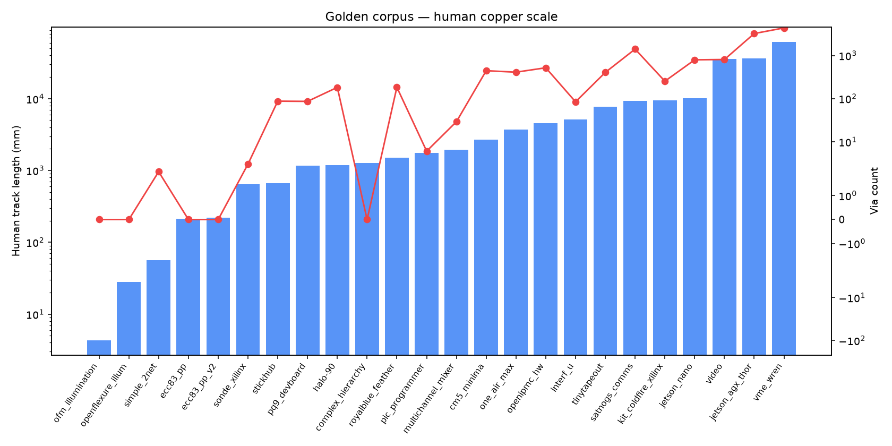
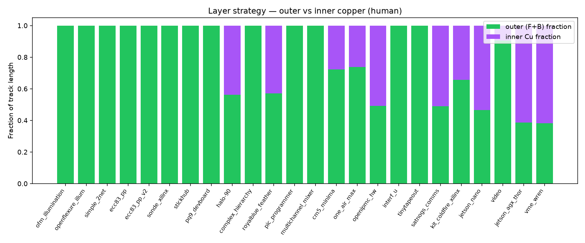
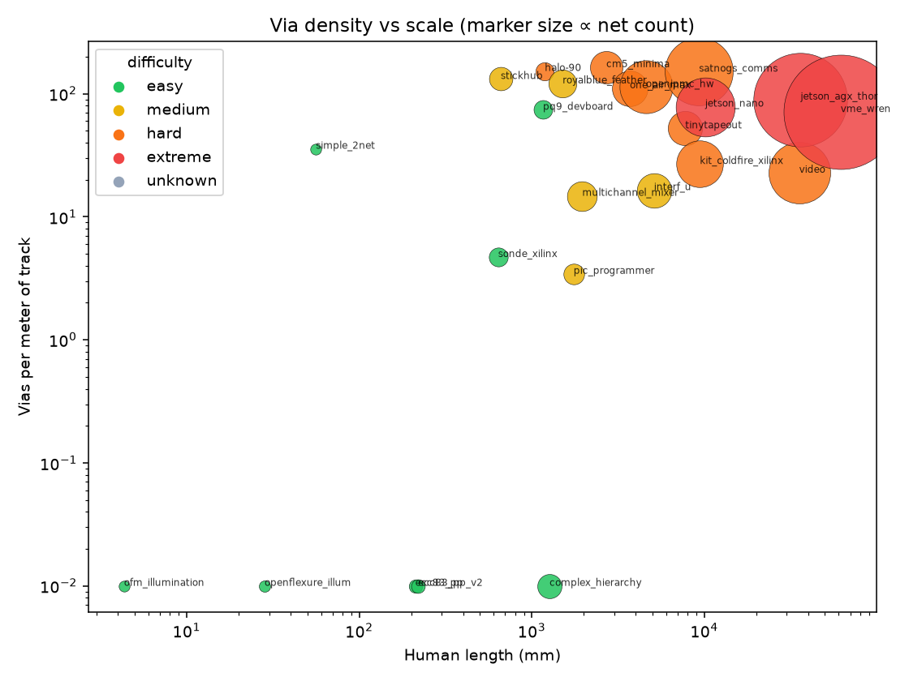
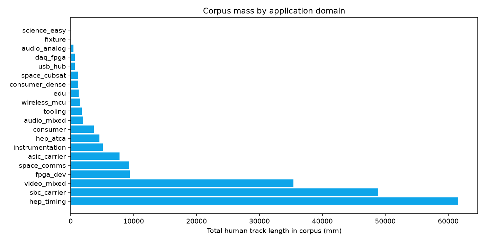
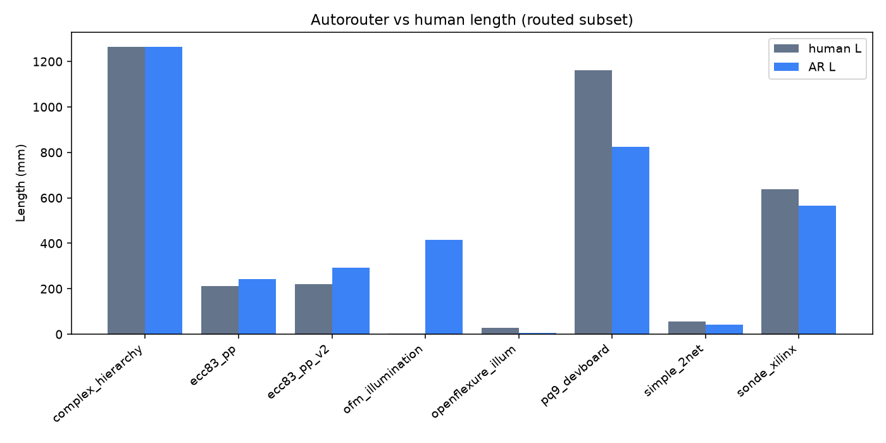
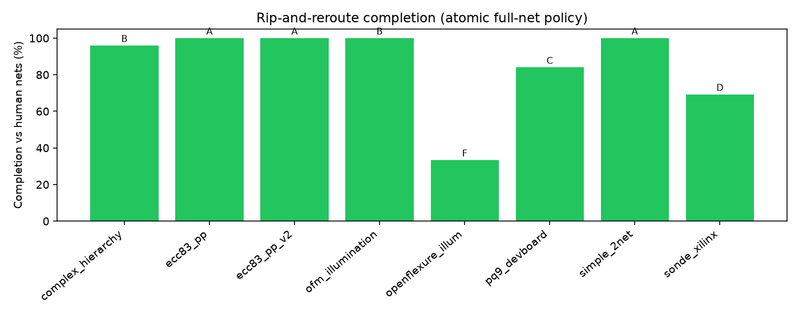
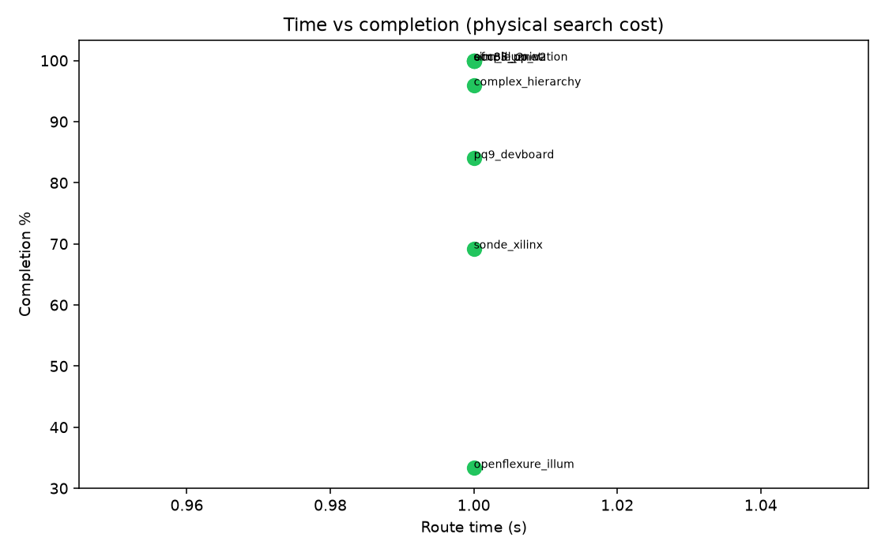

# Golden corpus: HEP, CERN-class, and open hardware boards

**TL;DR:** Human-routed open boards form a rip-and-reroute suite. Charts show copper scale, layer strategy, via density, and autorouter completion — with **physical reasons** behind decisions.

```bash
bash scripts/fetch_golden_boards.sh               # third_party clones
python scripts/golden_corpus_analyze.py           # inventory + charts
python scripts/golden_corpus_analyze.py --route-easy
physics-router golden-eval --manifest examples/golden/manifest.yaml --extract-only

# CI path (in-repo fixtures only)
physics-router golden-eval --manifest examples/golden/ci_manifest.yaml --hard-deadline

# Via-profile A/B (pin-access feasibility)
physics-router golden-eval --id simple_2net --rules-profile via_0p45
physics-router golden-eval --id simple_2net --rules-profile via_0p6
```

### Features (production)

| Feature | Behavior |
|---------|----------|
| **Zone-aware goldens** | Human filled zones count as copper; pour-only nets flagged in `missing_zone_pours` |
| **Pin-access + shared escapes** | Per-board `pin_access.json`; nearby sites merge so multipin trees charge one via |
| **Rules profiles** | `via_0p45` / `via_0p6` / `source` / JLCPCB floors for A/B reachability |
| **Hard deadline** | Child process killed at `timeout_s` (prevents StickHub-class hangs) |
| **CBS repair** | Bounded conflict-cluster re-route after AR (`--cbs-repair`) |

Artifacts: `viewer/runs/golden_corpus/` · images: `docs/images/golden/`

---

## Why these boards (physics + experiment context)

| Domain | Boards | What human routing optimizes for |
|--------|--------|----------------------------------|
| **HEP timing (CERN White Rabbit)** | `vme_wren` | Sub-ns sync: controlled impedance, short clock trees, layer-referenced striplines, minimal stubs on multi-Gb links |
| **HEP ATCA mgmt** | `openipmc_hw` | Hot-swap / IPMI: power planes first, service nets, isolation of management from payload noise |
| **Space / cubesat** | `pq9_devboard`, `satnogs_comms` | Mass/power, RF keepouts, CAN/differential pairs, thermal vias under regulators |
| **SBC / FPGA carriers** | Jetson, CM5, Coldfire+Xilinx, TinyTapeout | BGA escape: via farms, HDI-like density, length-matched memory buses |
| **Instrumentation / audio** | `interf_u`, `ecc83_*`, mixer | Analog: single-layer or guarded returns, star grounds, keep digital edges off sensitive nets |
| **Dense matrix (in-repo)** | `halo-90` | Charlieplex: annular topology, radial escapes, open > short |

PHENIX / sPHENIX front-end CAD is **not public**; WREN + OpenIPMC + dense matrix boards are the open proxies for that stress class.

---

## Physical influences that drive human routing

### 1. Electromagnetic environment

- **Return path continuity:** High-speed edges (WR multi-Gb, Jetson memory, video) stay over continuous reference planes; layer changes use **via + nearby ground via** so loop inductance stays low.
- **Impedance control:** Outer microstrip vs inner stripline — WREN/Jetson show substantial **inner copper fraction** when timing/SI dominates; audio `ecc83` stays **single-layer** to avoid via inductance and keep simple returns.
- **Crosstalk / isolation:** Analog and RF (SatNOGS, ECC83, mixer) segregate by layer and geometry; digital buses accept tighter packing.

### 2. Thermal and power integrity

- **Plane-first power:** ATCA IPMC and SBC boards pour `GND`/`VCC` early; tracks are necks to pads. Zero extracted vias on some 6-layer boards often means **filled zones + thermal connections**, not “no layer changes.”
- **Via farms under BGA:** Via density (vias per meter) spikes on Jetson/TinyTapeout — physics is **escape routing + current density**, not wirelength.

### 3. Manufacturability (DFM)

- Via size/drill and clearance floors (JLCPCB-class 0.15/0.60 rules) cap what an autorouter can legally place in 0402 rings (HALO lesson).
- Human layouts often use **tighter fab capability** than generic autorouter defaults → completion cliffs under conservative rules.

### 4. Topology before geometry

- White Rabbit / multipin buses: humans assign **layer bands** (like HALO CPX F/In1/In2), then geometrize.
- Autorouter policy **open > short** intentionally under-completes dense boards rather than emit illegal copper — charts of completion < 100% with hard_drc=0 are *honest*, not broken.

---

## Inventory table

**24** boards with human copper extracted.

| ID | Diff | Domain | Segs | Vias | Length mm | Nets | Cu layers | Outer frac | Via/m | Physics class |
|----|------|--------|-----:|-----:|----------:|-----:|----------:|-----------:|------:|---------------|
| `vme_wren` | extreme | hep_timing | 24858 | 4374 | 61605.97 | 1305 | 8 | 0.382 | 71.0 | `hs_multilayer_via_farm` |
| `jetson_agx_thor` | extreme | sbc_carrier | 19835 | 3235 | 36099.8 | 872 | 6 | 0.386 | 89.613 | `hs_multilayer_via_farm` |
| `video` | hard | video_mixed | 7932 | 808 | 35416.83 | 371 | 4 | 0.905 | 22.814 | `via_dense_escape` |
| `jetson_nano` | extreme | sbc_carrier | 15588 | 794 | 10101.09 | 340 | 5 | 0.465 | 78.605 | `inner_signal_stripline` |
| `kit_coldfire_xilinx` | hard | fpga_dev | 2935 | 253 | 9412.2 | 209 | 4 | 0.657 | 26.88 | `via_dense_escape` |
| `satnogs_comms` | hard | space_comms | 6673 | 1408 | 9309.44 | 455 | 4 | 0.49 | 151.244 | `inner_signal_stripline` |
| `tinytapeout` | hard | asic_carrier | 2143 | 405 | 7743.92 | 108 | 4 | 1.0 | 52.299 | `via_dense_escape` |
| `interf_u` | medium | instrumentation | 731 | 84 | 5101.46 | 110 | 2 | 1.0 | 16.466 | `general_digital` |
| `openipmc_hw` | hard | hep_atca | 4382 | 519 | 4584.14 | 272 | 6 | 0.491 | 113.216 | `hs_multilayer_via_farm` |
| `one_air_max` | hard | consumer | 1638 | 410 | 3698.2 | 117 | 4 | 0.737 | 110.865 | `via_dense_escape` |
| `cm5_minima` | hard | sbc_carrier | 1884 | 444 | 2699.81 | 96 | 4 | 0.723 | 164.456 | `via_dense_escape` |
| `multichannel_mixer` | medium | audio_mixed | 576 | 29 | 1959.31 | 79 | 2 | 1.0 | 14.801 | `outer_prefer_signal` |
| `pic_programmer` | medium | tooling | 370 | 6 | 1745.7 | 33 | 2 | 1.0 | 3.437 | `outer_prefer_signal` |
| `royalblue_feather` | medium | wireless_mcu | 943 | 183 | 1507.14 | 68 | 5 | 0.571 | 121.422 | `inner_signal_stripline` |
| `complex_hierarchy` | easy | edu | 364 | 0 | 1265.69 | 49 | 2 | 1.0 | 0.0 | `planar_or_pour_heavy` |
| `halo-90` | hard | consumer_dense | 4335 | 182 | 1188.48 | 23 | 4 | 0.563 | 153.136 | `inner_signal_stripline` |
| `pq9_devboard` | easy | space_cubsat | 196 | 86 | 1160.52 | 25 | 2 | 1.0 | 74.105 | `general_digital` |
| `stickhub` | medium | usb_hub | 1113 | 87 | 660.25 | 45 | 2 | 1.0 | 131.767 | `general_digital` |
| `sonde_xilinx` | easy | daq_fpga | 208 | 3 | 637.76 | 26 | 2 | 1.0 | 4.704 | `outer_prefer_signal` |
| `ecc83_pp_v2` | easy | audio_analog | 53 | 0 | 219.09 | 9 | 1 | 1.0 | 0.0 | `single_layer_analog` |
| `ecc83_pp` | easy | audio_analog | 59 | 0 | 211.0 | 8 | 1 | 1.0 | 0.0 | `single_layer_analog` |
| `simple_2net` | easy | fixture | 7 | 2 | 56.0 | 2 | 2 | 1.0 | 35.714 | `outer_prefer_signal` |
| `openflexure_illum` | easy | science_easy | 7 | 0 | 28.25 | 3 | 1 | 1.0 | 0.0 | `planar_or_pour_heavy` |
| `ofm_illumination` | easy | science_easy | 6 | 0 | 4.33 | 2 | 1 | 1.0 | 0.0 | `planar_or_pour_heavy` |

## Charts — human routing solutions

### Copper scale (length + vias)



Log scale makes WREN / Jetson / video dominate — those are the **SI + pin-escape** class. Small science boards sit two orders of magnitude lower.

### Outer vs inner copper



- High **outer fraction**: simpler digital/tooling, hand-routed topside preference.
- High **inner fraction**: stripline SI, EMC, or plane-adjacent critical nets (HEP timing, dense SBC).

### Via density vs board scale



Upper-right (long + via-dense) = BGA escape / HDI-like. Lower-right (long, few vias) often = **zone-heavy power/GND** where connectivity is pours not drills.

### Domain mass



---

## Autorouter rip-and-reroute results

| ID | Grade | Score | Completion | Hard DRC | AR L mm | Human L mm | AR vias | t (s) |
|----|-------|------:|-----------:|---------:|--------:|-----------:|--------:|------:|
| `complex_hierarchy` | B | 85.92 | 0.9592 | 0 | 1264.870506875791 | 1265.6867 | 3 | 1.0 |
| `ecc83_pp` | A | 100.0 | 1.0 | 0 | 242.2385139272789 | 210.9984 | 0 | 1.0 |
| `ecc83_pp_v2` | A | 96.7 | 1.0 | 0 | 291.91968745706157 | 219.0891 | 0 | 1.0 |
| `ofm_illumination` | B | 85.0 | 1.0 | 0 | 414.7380714848215 | 4.3295 | 1 | 1.0 |
| `openflexure_illum` | F | 23.33 | 0.3333 | 0 | 7.170057464636879 | 28.2482 | 0 | 1.0 |
| `pq9_devboard` | C | 64.0 | 0.84 | 0 | 823.2862690247445 | 1160.5158 | 1 | 1.0 |
| `simple_2net` | A | 100.0 | 1.0 | 0 | 42.93161798089106 | 56.0 | 2 | 1.0 |
| `sonde_xilinx` | D | 39.23 | 0.6923 | 0 | 565.5506550399298 | 637.7554 | 5 | 1.0 |

### AR vs human length



### Completion



### Time vs completion



### Reading the AR charts physically

1. **Completion < 1 with hard_drc=0** means the router refused illegal copper (correct under open>short).
2. **Shorter AR length than human** on easy boards can mean fewer detours — or missing nets; always read with completion.
3. **Via count ≠ quality**: humans may via-stitch grounds; AR may under-via and fail multipin connectivity.
4. **Extreme boards** (WREN, Jetson) are inventory goldens for *human* topology metrics; full AR manufacturing gate is a research target, not a CI fail yet.

---

## Decision guide: what to optimize next

| If chart shows… | Physical cause | Router work |
|-----------------|----------------|-------------|
| Low completion on multipin, 0 DRC | Congestion + pin access geometry | Conflict branching, shared escapes |
| High human via/m, AR few vias | Escape/fanout under-modeled | Pin-access oracle + via size profile |
| Human inner-heavy, AR outer-only | Layer assignment / via cost | Section layer plan + DSATUR + capacity mesh |
| AR longer than human at full completion | Weak topology / rubberband | Topology-preserving consolidation |
| Zone-heavy human, AR open power | Pours not tracks | Copper areas + KiCad refill connectivity |

---

## Sources & licenses

See [examples/golden/SOURCES.md](../examples/golden/SOURCES.md). Boards under `third_party/golden/` are **not** vendored into git (see `.gitignore`); fetch with `scripts/fetch_golden_boards.sh`.

Key upstreams: [OHWR](https://ohwr.org/), [WREN](https://ohwr.org/projects/wren/), KiCad `demos/vme-wren`, [OpenIPMC-HW](https://gitlab.com/openipmc/openipmc-hw), [SatNOGS COMMS](https://gitlab.com/librespacefoundation/satnogs-comms/satnogs-comms-hardware), [Antmicro Jetson baseboard](https://github.com/antmicro/jetson-nano-baseboard).

_Generated charts: 01_human_scale.png, 02_layer_strategy.png, 03_via_density.png, 04_domain_mass.png, 05_ar_vs_human_length.png, 06_ar_completion.png, 07_time_vs_completion.png_

