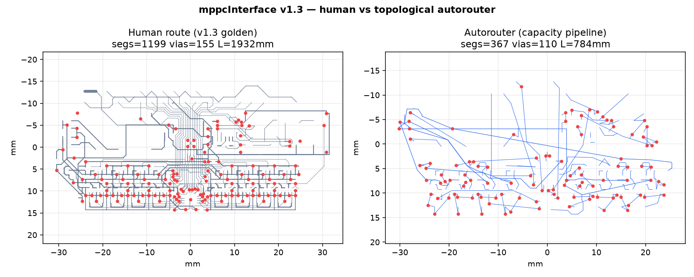
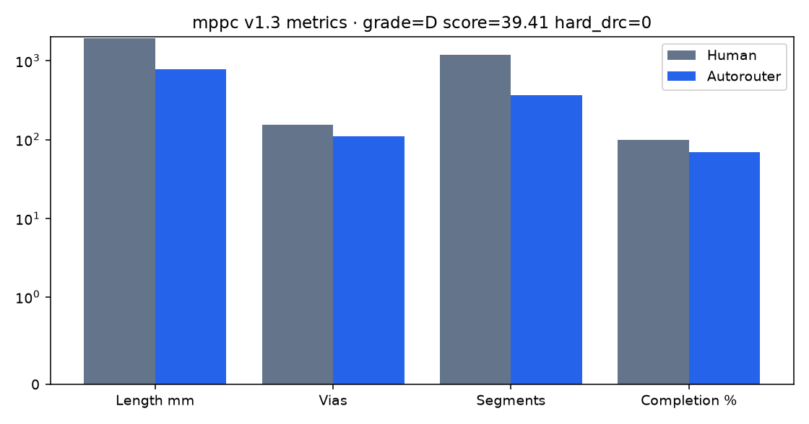
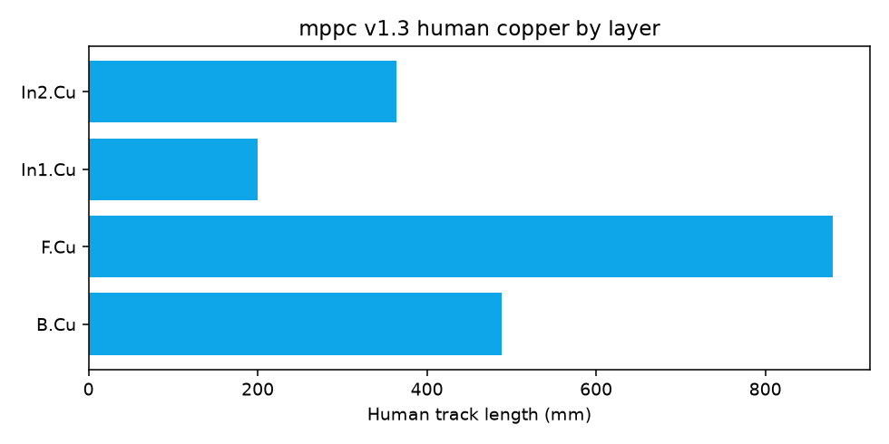

# Benchmark: mppcInterface v1.3 (human vs topological autorouter)

**Primary golden board for physicsRouter.** HEP SiPM/MPPC readout from
[muonTelescope/mppcInterface](https://github.com/muonTelescope/mppcInterface)
commit **`580c61d`** (*Initial update to 1.3*, 2020-08-21).

Design lineage includes sPHENIX-class bias/coincidence ideas (see upstream readme).
This revision is the best **electrically complete** human route in the repo history
(0 nets without copper; 4-layer stack; pours present).

---

## Board facts

| Item | Value |
|------|-------|
| Outline | **65.0 × 30.0 mm** |
| Components | **161** |
| Nets | **85** |
| Copper layers | `F.Cu, In1.Cu, In2.Cu, B.Cu` |
| Human segments | **1199** |
| Human vias | **155** |
| Human areas (pours) | **61** |
| Human length | **1931.8 mm** |
| Human unrouted | **0** |
| Topology guide length | ~1524–1563 mm |
| Steiner multipin nets | ~60–63 |
| Cut preflight feasible | True |
| Via profile (auto) | `via_0p6` · ~99% SMD escape reach |

Pinned files: `examples/mppc-interface/mppcInterface_v1.3.kicad_pcb` (+ `.kicad_pro`).

---

## Human vs autorouter







## Score vs human copper

### Desktop golden (Windows RTX 3070 · 2026-07-24)

| Metric | Human | Autorouter |
|--------|------:|-----------:|
| Status | golden | **PASS** (`expect: partial_ok`) |
| Golden grade | — | **D** |
| Golden score | — | **39.41** |
| Completion vs human nets | 100% | **0.6941** (59/85) |
| Hard DRC | 0 (assumed fabbed) | **0** |
| Length (mm) | 1931.8 | 777.6 |
| Vias | 155 | 110 |
| Segments | 1199 | 369 |
| Areas/pours | 61 | 2 |
| Wall time (s) | — | **~5899** (~98 min) |
| Host | — | OpenCL RTX 3070 · OpenMP 8 · ~32 GB |
| Pipeline | hand | capacity · effort **0.55** · DeepPCB 80/20 · no hard deadline |

Missing nets (26): `+3V3, +5V, +5V-A, CH0, CH2, CH6, CH7, CLK, DAC1, DAC3, DAC5, DAC6, DAC7, GND, GPIO18, GPIO22, GPIO23, HV, LED-0, LED-2, MISO, MOSI, Net-(C12-Pad1), Net-(R2-Pad2), ~CS_{FPGA}, ~FPGA_{RST}`

### Stage breakdown (same run)

```text
80_20 routine_2pin: parallel 10/20 + serial residual 1/10  → ~11/20
80_20 mid_3to6:     46/59
80_20 heavy_multipin: 1/6
completion_recovery: rip multipin for 2-pin salvage (+1); multipin restore 8/8
```

Diagnostics: incomplete nets · power/GND open · corridor hogging · global overflow
· empty rip-ups historically · open > short OK.

### Earlier Mac snapshot (effort 0.45)

| Metric | AR |
|--------|---:|
| Grade / score | F / 18.24 |
| Completion | 41/85 (48%) |
| Wall | ~28–35 min |

### Policy reading

- **Completion &lt; 1 with hard_drc = 0** is an *honest partial*: open copper beat shorts.
- Length shorter than human is only “better” if completion ≈ 1.0.
- Human 4-layer pours (61 areas) are a return-path asset the AR still under-uses.

---

## Segment microbenches (iterate without full golden)

Use these while raising grade — full capacity is too slow for day-to-day loops.

```bash
PYTHONPATH=src:native/build python scripts/microbench_segments.py --segment local_rc
PYTHONPATH=src:native/build python scripts/microbench_segments.py --segment 2pin
PYTHONPATH=src:native/build python scripts/microbench_segments.py --segment analog
PYTHONPATH=src:native/build python scripts/microbench_segments.py --segment hspeed
```

| Segment | Empty-board result | Wall | Implication |
|---------|-------------------:|-----:|-------------|
| `local_rc` | **6/6 (100%)** | 0.5 s | Easy RC pairs OK; not the grade cliff |
| `2pin` + residual 0.10 | **16/20 (80%)** | ~15 s (80/20) | Fine residual shipped; open GPIO/LED/FPGA |
| `analog` | **12/16 (75%)** | ~8 min | Analog is routable empty; full golden starves corridors |

Roadmap of levers: **[SCORE_ROADMAP.md](SCORE_ROADMAP.md)**.

---

## Why this board for topological autorouting

1. **Real HEP instrument** (SiPM bias, analog front-end, FPGA coincidence, Pi host).
2. **Complete human multilayer golden** at `580c61d` (HEAD is a later 2L/lib revision with open nets).
3. Stresses **power + HV + analog + digital** together — not a toy cross-over.
4. Fits the project scope: **topology (Steiner/capacity) → free-angle geometry → 0 hard DRC**.

### History note

Earlier commits (`8aa2399`→`a98f88b`) show progressive 2-layer routing; v1.3 is the
clean multilayer snapshot. See git log on `muonTelescope/mppcInterface`.

---

## Reproduce

```bash
bash scripts/build_native.sh
# PCB already pinned under examples/mppc-interface/
python scripts/run_mppc_benchmark.py

physics-router golden-eval \
  --id mppc_v1.3 \
  --manifest examples/mppc-interface/manifest.yaml \
  --pipeline capacity --effort 0.55

# Live progress window (omit --no-ui for GUI)
physics-router route \
  --pcb examples/mppc-interface/mppcInterface_v1.3.kicad_pcb \
  --config examples/mppc-interface/placement_config.yaml \
  --pipeline capacity --effort 0.55 \
  --out-json /tmp/mppc_ar.json
```

Artifacts: `viewer/runs/mppc_v1.3/` · desktop twin `viewer/runs/mppc_v1.3_win/` ·
images: `docs/images/golden/mppc_v13_*.png` · microbench: `viewer/runs/microbench/`.

_Updated 2026-07-31 · physicsRouter topological autorouter._
