# TopoR (Eremex) — reference for physicsRouter

**TL;DR:** Commercial free-angle / topology-first inspiration. We implement a **philosophy**, not their binary. Our geometry is open-source C++. Not affiliated with Eremex.

How we map ideas → code: [ARCHITECTURE_ROUTER.md](ARCHITECTURE_ROUTER.md).

This document records how **commercial TopoR** works (public product pages, manuals, and published comparisons) and how **physicsRouter** relates to those ideas.

| Official | Link |
|----------|------|
| Product | [eremex.com/products/topor](https://www.eremex.com/products/topor/) |
| Feature list | […/topor/features](https://www.eremex.com/products/topor/features/) |
| Competitive advantages | [autorouting](https://www.eremex.com/products/topor/competitiveadvantages/autorouting/), [design time](https://www.eremex.com/products/topor/competitiveadvantages/pcbdesigntime/), [high-speed](https://www.eremex.com/products/topor/competitiveadvantages/highspeedpcbs/) |
| Downloads (login) | [eremex.com/downloads](https://www.eremex.com/downloads/) |
| Version history | [support/topor-version-history](https://www.eremex.com/support/topor-version-history/) |
| Tutorials | [board examples](https://www.eremex.com/support/tutorials/topor6_0_examples/), [properties editor](https://www.eremex.com/support/tutorials/topor5_2/), [hi-speed](https://www.eremex.com/support/tutorials/hi-speed-design/) |
| Publications | [support/publications](https://www.eremex.com/support/publications/) |
| Wikipedia | [TopoR](https://en.wikipedia.org/wiki/TopoR) |

Local images and PDFs: [`docs/images/topor/`](images/topor/README.md) (© Eremex; research cache).

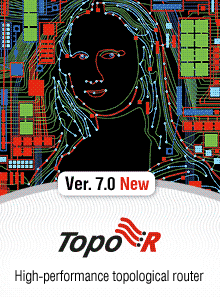

---

## 1. What TopoR is

**TopoR** (*Topological Router*) is a **PCB topology editor and autorouter**, not a full schematic-to-fab suite. Eremex positions it as:

- Fast routing quality that often beats slow manual routing.
- Tools that cut electronic-device design time dramatically.
- Algorithms that avoid conventional preferred directions (not limited to 90° / 45°).

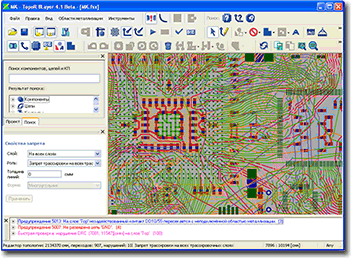

Compared with conventional CAD autorouters, TopoR’s public claims emphasize:

- **Shorter total wire length** and **fewer vias** → more free board area, larger clearances or pads, smaller board, or **fewer layers**.
- **Isotropic free-angle + arcs** → less forced parallelism → lower electromagnetic crosstalk.
- Ability to route **single-layer** boards where shape-based tools fail.

| Via / cost messaging | Crosstalk / free-angle | Single-layer claim |
|----------------------|------------------------|--------------------|
| 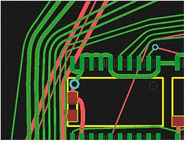 | 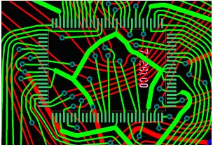 | 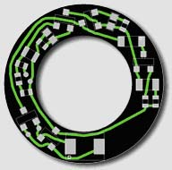 |

---

## 2. Available TopoR binaries (official catalog)

Eremex’s [downloads](https://www.eremex.com/downloads/) page currently lists **TopoR 7.0 build 18508** (installers dated 2017; user guide dated 2018):

| Package | Architecture | Size | Listed version | Date listed |
|---------|-------------:|-----:|---------------:|------------|
| TopoR Lite | x86 | 32.7 MB | 7.0.18508 | 09/20/2017 |
| TopoR Lite | x64 | 35 MB | 7.0.18508 | 10/11/2017 |
| TopoR Trial | x86 | 72 MB | 7.0.18508 | 10/11/2017 |
| TopoR Trial | x64 | 74.3 MB | 7.0.18508 | 10/11/2017 |
| User guide TopoR 7.0 | PDF | 10.1 MB | 7.0 | 07/24/2018 |

**Access:** the site requires login. Unauthenticated requests to download endpoints currently return **404**. Eremex asks users to log in or contact **info@eremex.com** if download fails.

**Recommendation:** use the **official x64 Lite or Trial** installer only — not third-party aggregators (often older 5.x/6.x, not authoritative). Main UI binary is historically `fside.exe`.

### Lite vs Trial vs commercial (historical)

The public page does not fully document 7.0 limits. Historically:

- **Lite** — permanently usable restricted edition.
- **Trial** — fuller commercial feature set under evaluation license.
- **Commercial** editions differentiated partly by **supported signal layers** (2 / 4 / 8 / 16 / up to 32 unrestricted).

Verify Lite/Trial restrictions in the installer license text (the published 7.0 guide may lag the binary).

---

## 3. Official documentation (local + remote)

| Document | Access | Local copy |
|----------|--------|------------|
| **TopoR 7.0 user guide** (10.1 MB, 2018) | Login download | *(login-only)* |
| **TopoR 6.1 user manual** (English, ~208 pp, Jul 2015) | [Public PDF](https://www.eremex.com/support/documentation/461750.pdf) | Download locally (gitignored `docs/images/topor/*.pdf`) |
| **Feature datasheet** | [Public PDF](https://www.eremex.com/products/topor/features/445337.pdf) | Download locally (gitignored) |
| Version history (5.x–6.2) | [Web](https://www.eremex.com/support/topor-version-history/) | — |
| Board routing examples (CIRCLE1, CIRCLE3, light-controller, planes) | [Tutorials](https://www.eremex.com/support/tutorials/topor6_0_examples/) | ZIP / old Flash movies |
| Design Properties Editor tutorials | [TopoR 5.2](https://www.eremex.com/support/tutorials/topor5_2/) | — |
| High-speed design tutorials | [TopoR 6.0](https://www.eremex.com/support/tutorials/hi-speed-design/) | — |
| Papers (*Isotropic PCB Routing*, BGA routing problems, topological CAD concepts) | [Publications](https://www.eremex.com/support/publications/) | — |

---

## 4. How TopoR fits a PCB workflow

TopoR is primarily an **interchange autorouter / topology editor**:

```text
Schematic / layout CAD
        │  Export unrouted board + netlist
        ▼
 DSN / P-CAD / PADS / Eagle / HKP / FST
        │
        ▼
      TopoR
  ├─ Import and normalize design
  ├─ Configure stackup and rules
  ├─ Construct connection topology
  ├─ Generate routing variants
  ├─ Optimize topology, vias and geometry
  ├─ Manual topology adjustment
  └─ DRC and final cleanup
        │
        ▼
 SES / P-CAD / PADS / Gerber / DXF / Excellon
        │
        ▼
Original PCB CAD or manufacturing output
```

Documented user loop (manual):

1. Edit parameters.
2. Perform autorouting.
3. Edit topology manually.
4. Check design rules.
5. Output the result.

Steps 2–4 repeat until an acceptable **variant** is obtained.

### Import / export (TopoR 6.1 manual)

**Import:** Specctra/Electra `.dsn`, P-CAD ASCII `.pcb`, PADS ASCII `.asc`, Mentor Expedition `.hkp`, Eagle `.brd`, TopoR plain-text `.fst`.

**Export:** CAD exchange + Gerber, Excellon, DXF, etc.

For modern **KiCad**, Specctra **DSN/SES** is the natural conceptual bridge. Current KiCad no longer has the same built-in Specctra workflow as older releases — use conversion tooling or intermediate CAD. **physicsRouter** exports DSN via `dsn_export` for FreeRouting baselines and applies copper back to `.kicad_pcb` natively.

---

## 5. How the routing software works

Exact algorithms are proprietary. Below combines **explicit Eremex documentation** with clearly marked architectural inference.

### 5.1 Topology first, geometry second

Traditional routers often commit early to grid or fixed 45° segments. TopoR treats a connection first as a **topological path** (which obstacles are passed, in what order). The geometry engine then derives legal straight/arc segments.

```text
Pad A → around obstacle X → between pads Y/Z → via → Pad B
        (topology)  ──►  efficient wire shape (geometry)
```

That is why traces stay “flexible” after routing and why components can move without destroying connectivity.

| Topology can touch / cross (even parity) | One-shot “string” to legal clearances |
|------------------------------------------|----------------------------------------|
| 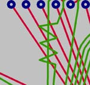 | 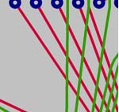 |

### 5.2 Isotropic (any-angle) routing + arcs

No preferred H/V direction per layer. Paths may use arbitrary angles and arc transitions — **isotropic routing**. Benefits: denser packing, shorter paths, more equal spacing (critical for differential pairs).

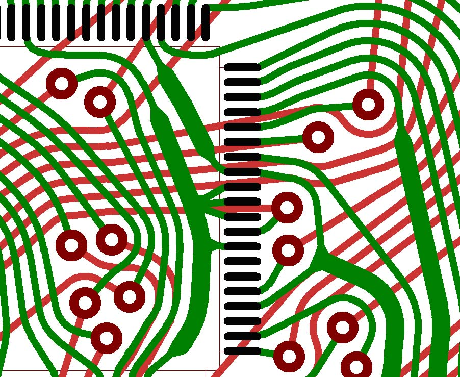

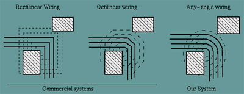

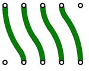

Feature-list free-angle illustrations:

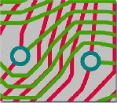 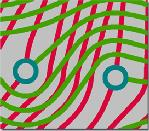

### 5.3 Instant connectivity, then multiobjective optimization

TopoR can **route 100% of nets almost instantly**, even with temporary clearance / technology violations, then runs multiobjective optimization over **alternative variants** (length, vias, narrow spaces, …). Routing can be stopped early to judge feasibility (layer count, clearance) without multi-hour dead ends.

Simplified model:

```text
Phase A  Find connectivity — all nets get topological paths
Phase B  Reduce conflicts — move paths, vias, optionally components
Phase C  Optimize — vias, length, rule violations
Phase D  Geometrize — exact traces and clearances
```

This differs from strictly sequential maze routers that permanently block later nets.

### 5.4 Multiple routing variants in parallel

Several alternative layouts are optimized simultaneously (different objectives / layer distributions). The user chooses one or more variants. Parallelism can use multiple cores or machines on a LAN.

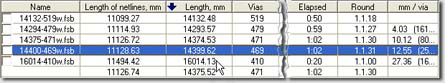

```text
Initial topology
   ├─ Variant A: minimize vias
   ├─ Variant B: minimize length
   ├─ Variant C: dense-area strategy
   └─ Variant D: alternate layer assign
         → evaluate / prune → mutate survivors
```

(The docs do **not** establish a formal genetic algorithm.)

### 5.5 Continuous re-geometry

Moving a component or via recalculates local physical geometry while keeping topological relationships.

| Before moving capacitor | After |
|-------------------------|-------|
| 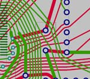 | 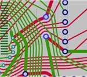 |

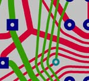

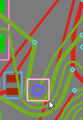

### 5.6 Modular automatic procedures

Visible as separate operations (version history / UI panels), not one monolithic “route” button:

- Calculate wire shapes  
- Optimize wire routes  
- Shift vias / components  
- Remove unnecessary vias  
- Correct DRC violations  
- Repour copper  
- Length-match signals  
- Optimize layer assignments  

### 5.7 Layer assignment and via minimization

Multilayer work is topology + **layer separation** (crossings, forbidden layers, planes, net groups). Published work reports further via reduction (on the order of a few to ~11% in tested examples) via specialized via-minimization.

### 5.8 BGA strategies

Special handling for pad fields, channels, under-BGA impedors (enhanced in 6.x), neck-down, layer transitions.

| TopoR BGA | Shape-based BGA |
|-----------|-----------------|
| 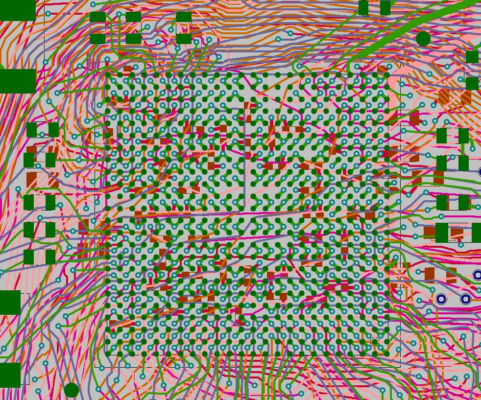 | 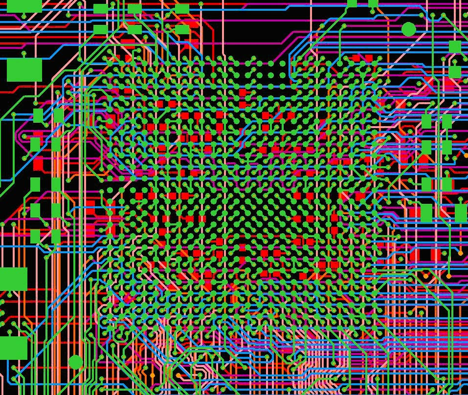 |

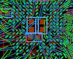

### 5.9 High-speed constraints

- Per-net / class length limits  
- Differential pairs; length equality within a pair; bus of pairs  
- Delay alignment  
- Serpentine / **randomly oriented trapezoid** tuning (computational precision quoted at **50 nm** — not fab tolerance)

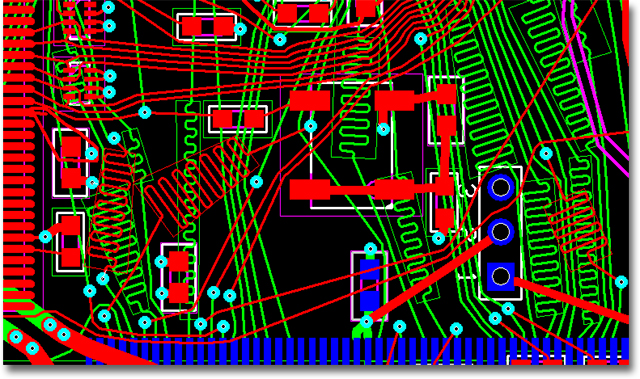

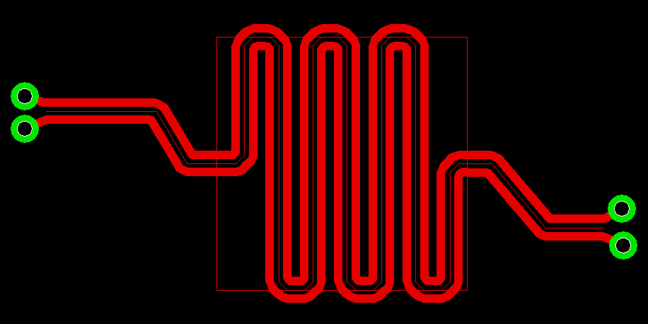

### 5.10 Manual + assisted topology

Manual routing can propose a path on the active layer (accept or ignore). **FreeStyle** mode treats traces as elastic topological objects. Logical **pin equivalence** can reassign FPGA/IC pins with ECO tracking.

| Without pin equivalence | With pin equivalence |
|-------------------------|----------------------|
| 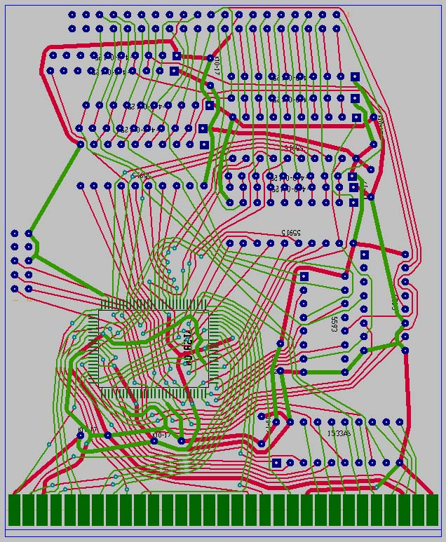 | 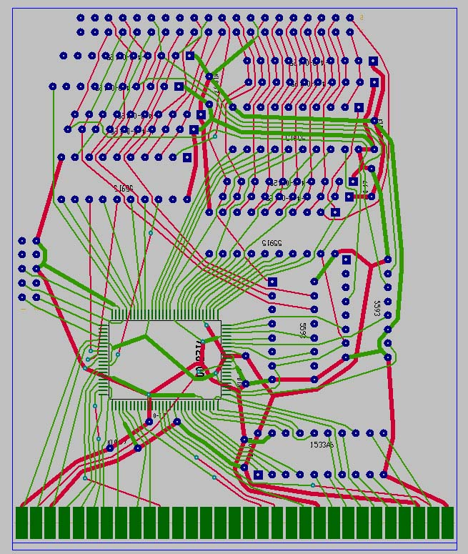 |
| 67 vias · 5.21 m | 17 vias · 3.79 m |

---

## 6. Published comparison examples (Eremex)

### Single-layer (complete vs incomplete)

| TopoR (no jumpers, &lt;1 s) | Shape-based (~56% completion) |
|----------------------------|-------------------------------|
| 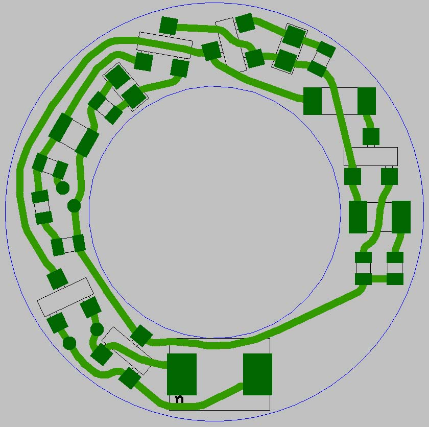 | 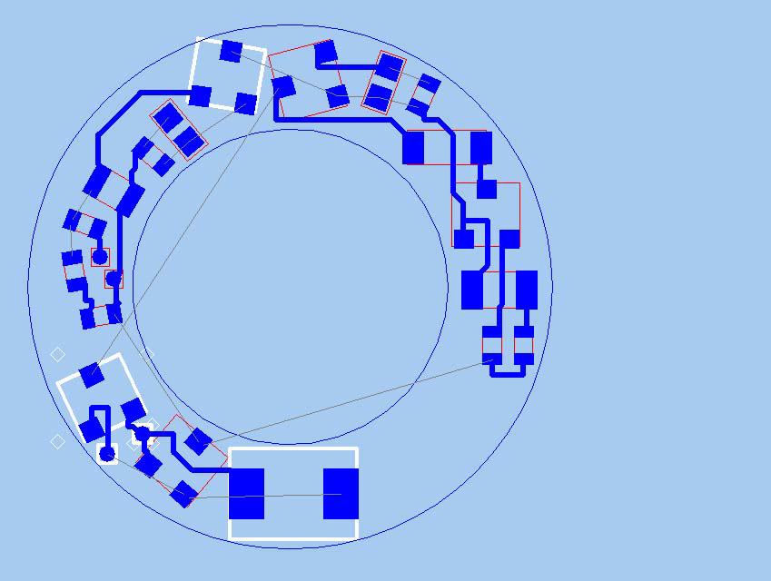 |

### Flexible PCB (vias in bend region)

| Shape-based (346 in, 61 vias) | TopoR (322 in, **0 vias**) |
|------------------------------|----------------------------|
| 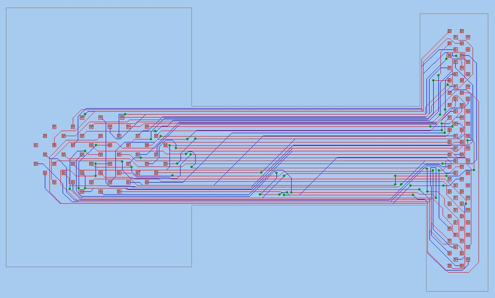 | 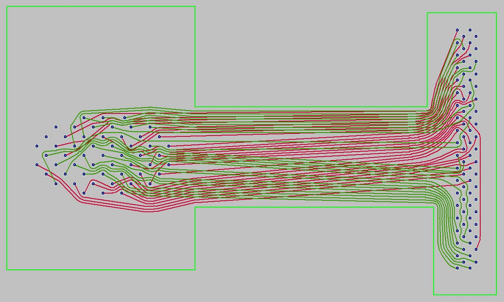 |

### Dense multilayer (same constraints)

| Popular autorouter · **8 layers** | TopoR · **2 layers** |
|-----------------------------------|----------------------|
| 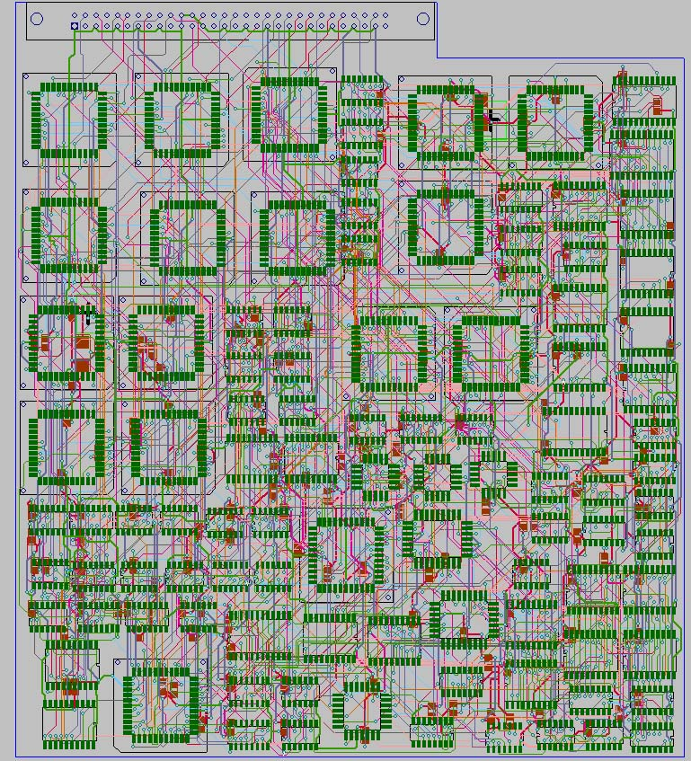 | 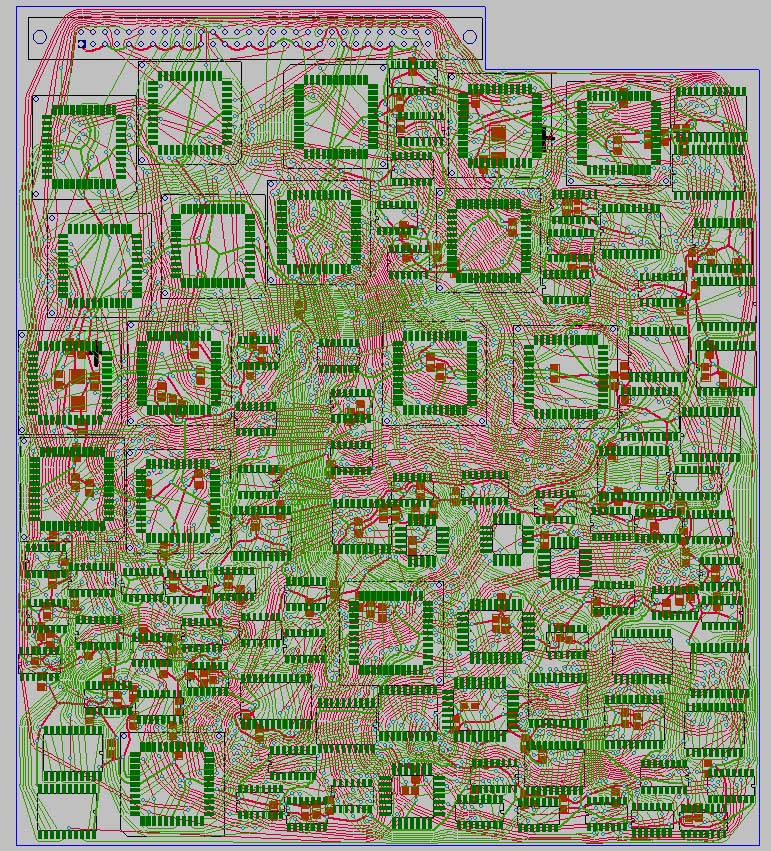 |
| 48 m · 1619 vias | 42 m · 1235 vias |

### Productivity case study (customer quote on product site)

| Manual · 2 weeks | TopoR · ~1 hour (20 min auto + 40 min manual) |
|------------------|-----------------------------------------------|
| 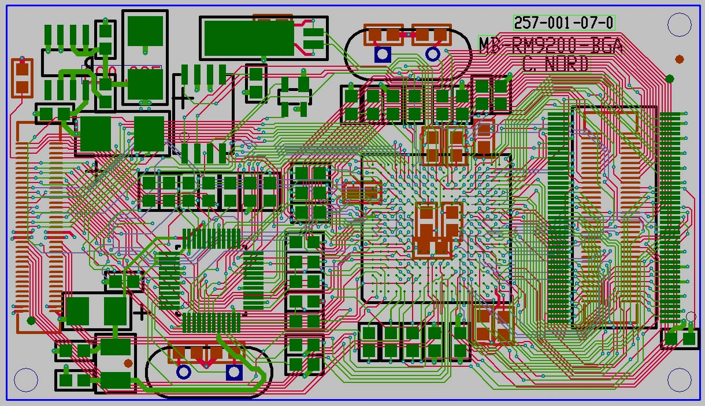 | 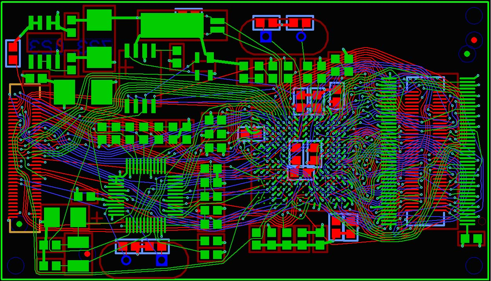 |
| 510 vias · 6.5 m | 432 vias · 5.11 m |

---

## 7. Project / file model

| Extension | Role |
|-----------|------|
| `.fsx` | Editable TopoR design |
| `.fsb` | Saved autorouting variant (can resume with original params) |
| `.fst` | Plain-text TopoR PCB interchange |

Install layout (manual): `BIN/` executables, `HELP/` docs, `EXAMPLES/` projects. Commercial licensing historically used a hardware dongle driver.

---

## 8. Version history highlights (public)

Summarized from [TopoR version history](https://www.eremex.com/support/topor-version-history/):

| Line | Themes |
|------|--------|
| **3.x–4.x** | Autoplace, FreeStyle, Gerber/DXF/ECO, DSN/SES (replace Specctra/Electra) |
| **5.x** | Signals / delay sync, diff-pair restore, Eagle BRD, non-through vias, keepouts for vias |
| **6.0** | UI overhaul, autorouting + automatic-procedure panels, FreeStyle arcs, BGA + under-package impedors, flexible piecemeal routing |
| **6.1** | Multilayer quality, automatic placement, net coloring, TopoR PCB format 1.1.3 |
| **6.2** | New pad shapes, pad-corner connect, **editable netlist**, multi-layer speedups |
| **7.0** | Current download catalog (2017 binaries / 2018 guide) — full changelog not fully public without guide |

---

## 9. Practical evaluation checklist

1. Export unrouted board to DSN (or other supported format).  
2. Import into official Lite/Trial.  
3. Verify stackup, outline, padstacks, net classes, keepouts.  
4. Set min/preferred widths and clearances.  
5. Assign layers and via types.  
6. Separate clocks / RF / pairs / power.  
7. Route first variants; compare length, vias, violations, unrouted.  
8. Optimize best 2–3 variants; manual fix critical regions.  
9. TopoR DRC → export → **origin CAD DRC** (conversion may drop rules/zones).  
10. Inspect footprints, vias, zones, pairs before fab.

---

## 10. Bottom line (commercial TopoR)

TopoR’s differentiator is not “curved traces for cosmetics.” The core model is:

> **Find and optimize flexible topological relationships first, then repeatedly derive exact geometry.**

That enables free-angle isotropic routing, component moves on a live layout, via reduction, multi-variant parallel optimization, and strong BGA/flex stories in Eremex materials.

---

## 11. Mapping to physicsRouter

**physicsRouter is inspired by** topological free-angle ideas (Dayan/SURF + TopoR product concepts). It is **not** a reimplementation of TopoR’s proprietary engine.

| Commercial TopoR idea | physicsRouter today |
|----------------------|---------------------|
| Topology-first free-angle copper | `topor_style_route` / `clearance_aware_route`: LOS → isotropic detours → A\* → rubberband |
| Isotropic (no H/V preferred) | Default `style=isotropic`; any-angle detours + perpendicular bulges (not 45°/90° locked) |
| Clearance / multi-layer vias | KiCad DRC floors; soft fallback **off**; via then same-layer prefer |
| Multi-variant parallel search | Net-order variants + score/prune (`quality.variants_ranked`, `winner`) |
| Geometry polish | `rubberband_cleanup` + `remove_redundant_vias` after connectivity |
| Instant illegal → optimize | Open edges preferred over illegal “soft” copper |
| Component move + re-geometry | Placement SA on unlocked parts; full FreeStyle live re-geometry deferred |
| High-speed length / diff pairs | Physics scores + length proxies; full trapezoid tuner deferred |
| BGA special cases | Angular fanout anchors; pad-accurate escape still roadmap |
| Interchange | Specctra **DSN export**; copper **apply to KiCad**; no `.fsx`/`.fsb` |
| Speed | Optional **C++/OpenCL** `pr_native` for experiments; Python clearance authority |
| UX | **2D** during Route; **3D EMS** only on Simulate (OpenEMS) |

See also [RESEARCH.md](../RESEARCH.md) §3.5, [DESIGN.md](../DESIGN.md), [DATASETS.md](../DATASETS.md).

---

## 12. References (official + local)

1. Eremex, *TopoR* product page — https://www.eremex.com/products/topor/  
2. Eremex, *TopoR Main Features* — https://www.eremex.com/products/topor/features/  
3. Eremex, *High-quality autorouting* — https://www.eremex.com/products/topor/competitiveadvantages/autorouting/  
4. Eremex, *PCB design time reduction* — https://www.eremex.com/products/topor/competitiveadvantages/pcbdesigntime/  
5. Eremex, *Design of complex and high-speed PCBs* — https://www.eremex.com/products/topor/competitiveadvantages/highspeedpcbs/  
6. Eremex, Downloads catalog — https://www.eremex.com/downloads/  
7. Eremex, TopoR 6.1 User Manual PDF — https://www.eremex.com/support/documentation/461750.pdf  
8. Eremex, TopoR datasheet PDF — https://www.eremex.com/products/topor/features/445337.pdf  
9. Eremex, Version history — https://www.eremex.com/support/topor-version-history/  
10. Wikipedia, *TopoR* — https://en.wikipedia.org/wiki/TopoR  
11. Local image cache — [`docs/images/topor/`](images/topor/README.md)  
