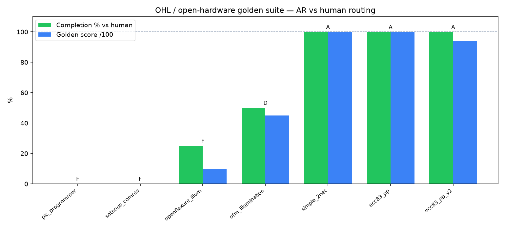
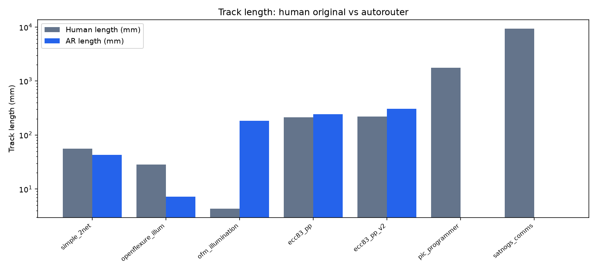
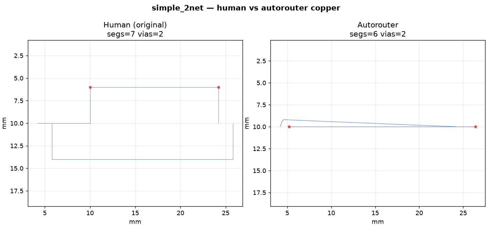
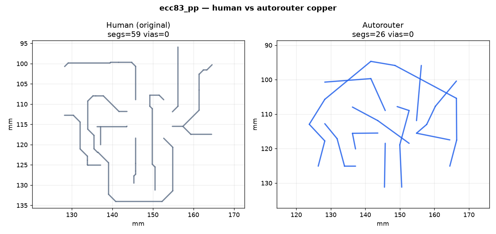
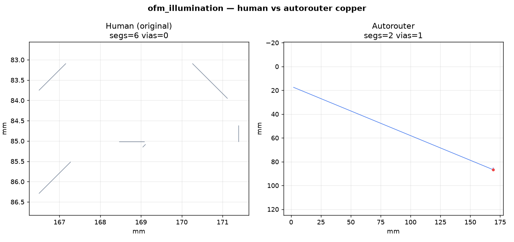
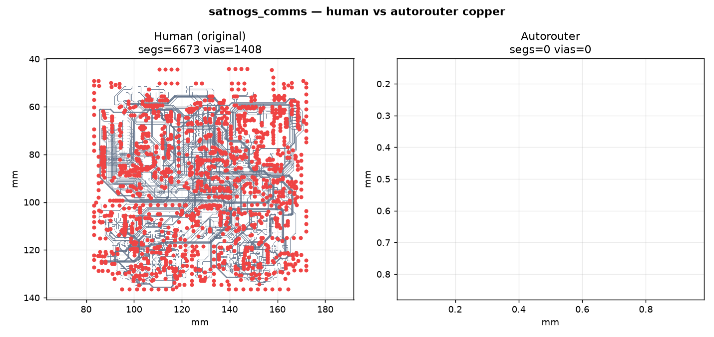
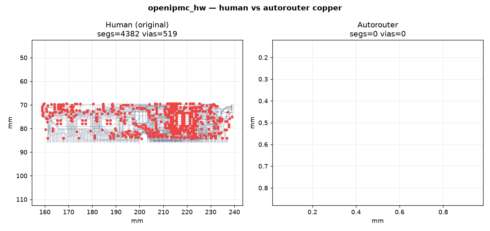
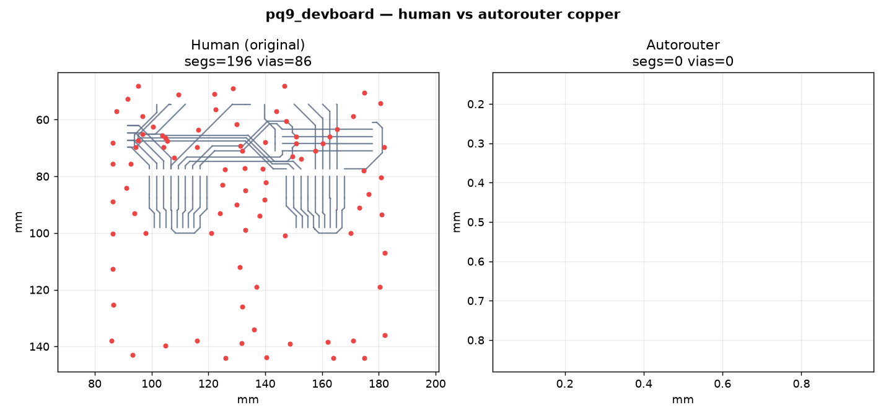

# Golden board suite

**TL;DR:** Known-good human-routed PCBs → rip copper → autoroute → score against human routing.

## Protocol

1. **Extract** board-level `(segment)` / `(via)` copper as the human golden `RouteResult`
2. **Route** from placement + nets only (human tracks are not search obstacles)
3. **Write** AR copper with tracks/vias cleared (`clear_existing_copper=True`)
4. **Score** completion vs human nets, hard DRC, length/via deltas, layer agreement

Policy: **open nets beat shorts**. Length/via wins only count when AR finishes human nets.
SPICE/OpenEMS feedback runs only on **fully legal** complete routes (`improve --physics-feedback`).

## Run

```bash
# Full suite (routes each board; hard deadline kills hung native search)
physics-router golden-eval --manifest examples/golden/manifest.yaml --hard-deadline

# CI-safe in-repo fixture only
physics-router golden-eval --manifest examples/golden/ci_manifest.yaml

# OHL / open-hardware gallery (score vs human + images)
bash scripts/fetch_golden_boards.sh
python scripts/run_ohl_golden_gallery.py --effort 0.45

# Extract human copper only (no native route — good CI smoke for parsers)
physics-router golden-eval --manifest examples/golden/manifest.yaml --extract-only

# One board + via profile A/B + CBS repair
physics-router golden-eval --id simple_2net --pipeline capacity --effort 0.55 \
  --rules-profile via_0p45 --cbs-repair

# Optional KiCad oracle (needs kicad-cli)
physics-router golden-eval --id simple_2net --kicad-drc
```

Artifacts also include `pin_access.json` (inner reachability + shared-escape savings).

Artifacts per board: `human_route.json`, `ar_route.json`, `*_ar.kicad_pcb`,
`golden_compare.json`, `golden_compare.md`. Suite summary: `suite_results.json`.

## Manifest fields

| Field | Meaning |
|-------|---------|
| `id` | Board key / output folder name |
| `pcb` | Path to human-routed `.kicad_pcb` (relative to repo or manifest dir) |
| `config` | Optional `placement_config.yaml` |
| `expect` | `manufacturing_gate` (full complete + 0 DRC) or `partial_ok` |
| `min_completion` | Soft floor on AR nets / human copper nets (0–1) |
| `timeout_s` | Soft wall-clock warning / hard kill when using hard deadline |
| `difficulty` | Label only (`easy` / `hard`) |

---

## OHL / open-hardware gallery (latest run)

Rip-and-reroute vs **original human copper** on CERN-OHL and public demo boards.
Full table: **[RESULTS.md](RESULTS.md)**.

### Scoreboard





### Snapshot table

| Board | License | Grade | Completion | Hard DRC | Status |
|-------|---------|-------|------------|----------|--------|
| `simple_2net` | MIT fixture | **A** | 100% | 0 | PASS |
| `ecc83_pp` | KiCad demo | **A** | 100% | 0 | PASS |
| `ecc83_pp_v2` | KiCad demo | **A** | 100% | 0 | PASS |
| `ofm_illumination` | CERN-OHL | D | 50% | 0 | PASS (partial) |
| `openflexure_illum` | CERN-OHL-S | F | 25% | 0 | PASS (partial / pour-heavy) |
| `pic_programmer` | KiCad demo | F | 0% | 0 | PASS (open policy) |
| `satnogs_comms` | CERN-OHL | F | 0% | 0 | PASS (open policy) |
| `pq9_devboard` | CERN-OHL | — | — | — | TIMEOUT (90s) |
| `complex_hierarchy` | KiCad demo | — | — | — | TIMEOUT (90s) |
| `sonde_xilinx` | KiCad demo | — | — | — | TIMEOUT (90s) |
| `multichannel_mixer` | KiCad demo | — | — | — | TIMEOUT (120s) |
| `openipmc_hw` | OpenIPMC | — | — | — | TIMEOUT (180s) |

`PASS` with completion &lt; 1 and hard DRC = 0 means the router refused illegal copper (honest partial).

### Example copper compares (human left · AR right)

| `simple_2net` (full) | `ecc83_pp` (full) |
|:---:|:---:|
|  |  |

| `ofm_illumination` (CERN-OHL) | `satnogs_comms` (CERN-OHL) |
|:---:|:---:|
|  |  |

| `openipmc_hw` (timeout — human extract) | `pq9_devboard` (timeout — human extract) |
|:---:|:---:|
|  |  |

More boards: [RESULTS.md](RESULTS.md) · images under `docs/images/golden/ohl_*.png`.

---

## HEP / CERN / experiment corpus

```bash
# Clone open boards (WREN demo, OpenIPMC, SatNOGS, Jetson, KiCad demos, …)
bash scripts/fetch_golden_boards.sh

# Inventory human copper + charts + physics report
python scripts/golden_corpus_analyze.py
python scripts/golden_corpus_analyze.py --route-easy

# OHL gallery (scores + compare images)
python scripts/run_ohl_golden_gallery.py

# Docs: docs/GOLDEN_CORPUS.md  ·  charts: docs/images/golden/
```

PHENIX/sPHENIX CAD is not public; WREN + OpenIPMC + HALO act as open stress proxies.

## Adding boards

1. Prefer fabbed / DRC-clean human routes with clear licenses.
2. Drop `.kicad_pcb` under `tests/fixtures/golden/` or point at `third_party/golden/`.
3. Add an entry to `manifest.yaml` and `scripts/golden_corpus_analyze.py` `BOARD_PATHS`.
4. Start with `expect: partial_ok` and `min_completion: 0` until the router is reliable.

See: [SOURCES.md](SOURCES.md) · [RESULTS.md](RESULTS.md) · [docs/GOLDEN_CORPUS.md](../../docs/GOLDEN_CORPUS.md) · [DATASETS.md](../../DATASETS.md)
