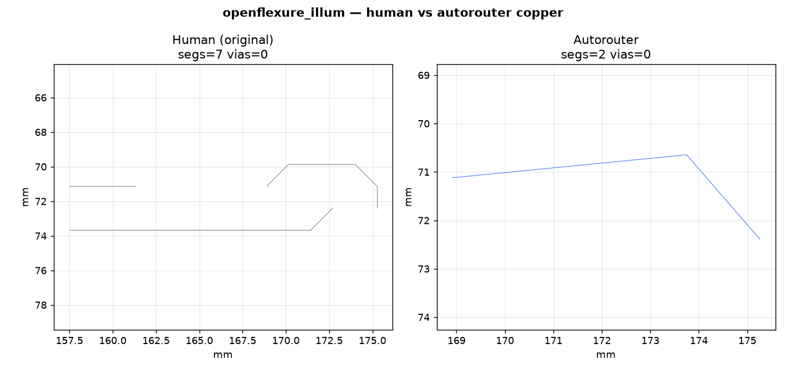
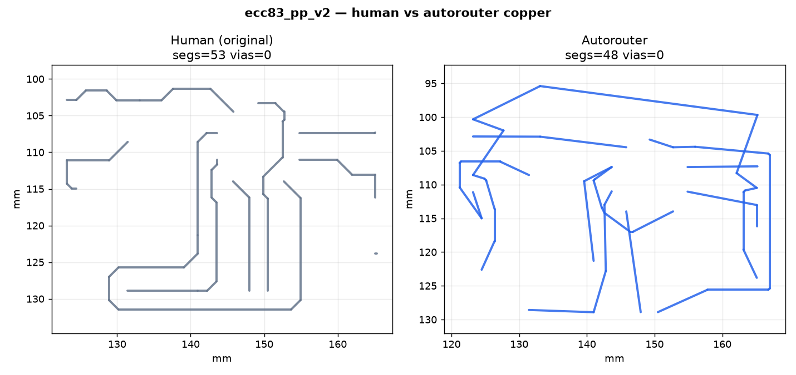
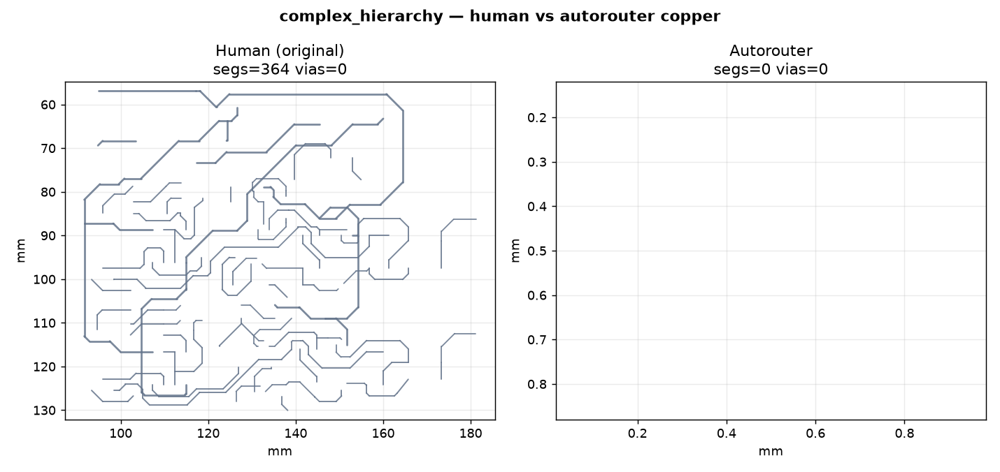
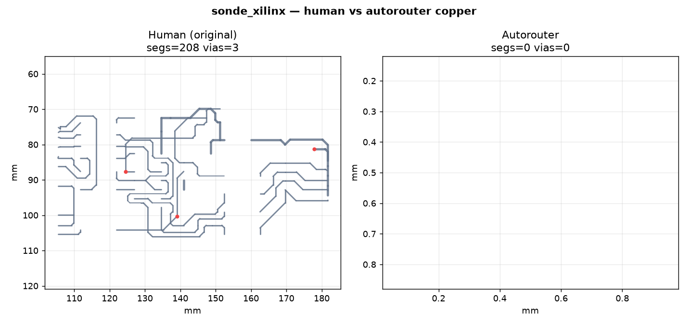
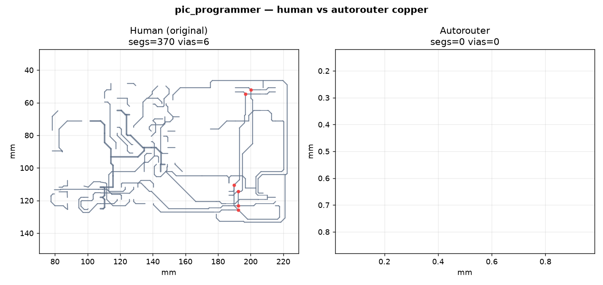
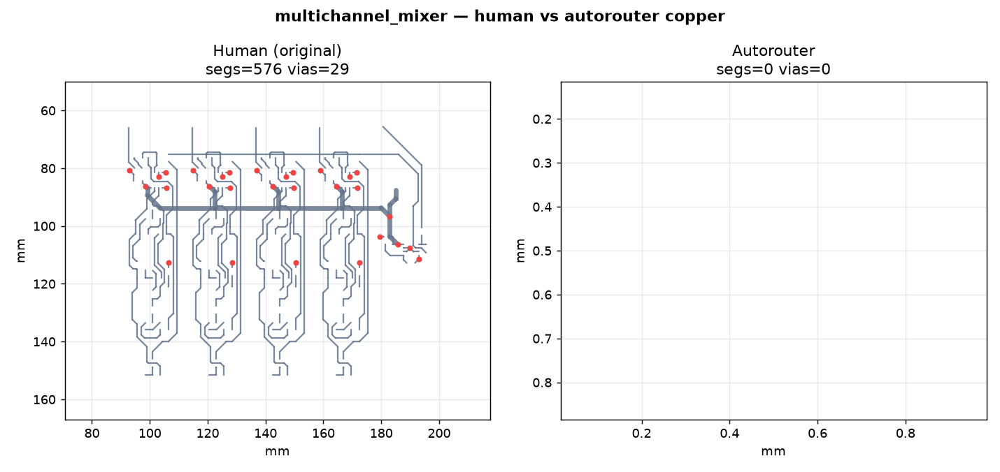

# OHL / open-hardware golden results

Rip-and-reroute scores against **original human copper** on CERN-OHL and public demo boards.

Policy: open nets beat shorts; hard DRC must stay 0 on committed copper.

Generated by `scripts/run_ohl_golden_gallery.py`. Suite dir: `viewer/runs/ohl_gallery/`.

## Scoreboard

## Table

| Board | License | Diff | Grade | Score | Completion | Hard DRC | AR L mm | Human L mm | AR vias | Human vias | t (s) | Status |
|-------|---------|------|-------|------:|-----------:|---------:|--------:|-----------:|--------:|-----------:|------:|:------:|
| `simple_2net` | MIT (fixture) | easy | A | 100.0 | 1.0 | 0 | 42.93161798089106 | 56.0 | 2 | 2 | 0.239 | PASS |
| `openflexure_illum` | CERN-OHL-S | easy | F | 10.0 | 0.25 | 0 | 7.170057464636879 | 28.2482 | 0 | 0 | 0.333 | PASS |
| `ofm_illumination` | CERN-OHL | easy | D | 45.0 | 0.5 | 0 | 182.7666121856216 | 4.3295 | 1 | 0 | 0.357 | PASS |
| `pq9_devboard` | CERN-OHL | easy | — | — | — | — | — | 1160.5158 | — | 86 | 90.004 | ERR |
| `ecc83_pp` | KiCad demo | easy | A | 100.0 | 1.0 | 0 | 243.3479503837749 | 210.9984 | 0 | 0 | 2.401 | PASS |
| `ecc83_pp_v2` | KiCad demo | easy | A | 94.15 | 1.0 | 0 | 305.87726327489196 | 219.0891 | 0 | 0 | 3.348 | PASS |
| `complex_hierarchy` | KiCad demo | easy | — | — | — | — | — | 1265.6867 | — | 0 | 90.004 | ERR |
| `sonde_xilinx` | KiCad demo | easy | — | — | — | — | — | 637.7554 | — | 3 | 90.004 | ERR |
| `pic_programmer` | KiCad demo | medium | F | 0.0 | 0.0 | 0 | 0.0 | 1745.703 | 0 | 6 | 0.877 | PASS |
| `multichannel_mixer` | KiCad demo | medium | — | — | — | — | — | 1959.3072 | — | 29 | 120.004 | ERR |
| `openipmc_hw` | open (OpenIPMC) | hard | — | — | — | — | — | 4584.1431 | — | 519 | 180.024 | ERR |
| `satnogs_comms` | CERN-OHL | hard | F | 0.0 | 0.0 | 0 | 0.0 | 9309.4412 | 0 | 1408 | 9.283 | PASS |

## Per-board copper (human left · AR right)

### `simple_2net`

### `openflexure_illum`

Missing vs human: `GND, Net-(J1-Pad1), net_3`

### `ofm_illumination`

Missing vs human: `Net-(J1-Pad1)`

### `pq9_devboard`

### `ecc83_pp`

### `ecc83_pp_v2`

### `complex_hierarchy`

### `sonde_xilinx`

### `pic_programmer`

Missing vs human: `/CLOCK-RB6, /DATA-RB7, /PC-CLOCK-OUT, /PC-DATA-IN, /PC-DATA-OUT, /VPP_ON, /VPP{slash}MCLR, /pic_sockets/VCC_PIC, Net-(C5-Pad1), Net-(D1-A), Net-(D1-K), Net-(D10-A), Net-(D11-A), Net-(D11-K), Net-(D12-A), Net-(D2-A)`

### `multichannel_mixer`

### `openipmc_hw`

### `satnogs_comms`

Missing vs human: `/BUS_FPGA_UART1_RX, /BUS_FPGA_UART1_TX, /BUS_FPGA_UART2_RX, /BUS_FPGA_UART2_ΤX, /BUS_I2C1_SCL, /BUS_I2C1_SDA, /BUS_I2C2_SCL, /BUS_I2C2_SDA, /BUS_SPI1_CLK, /BUS_SPI1_CS, /BUS_SPI1_MISO, /BUS_SPI1_MOSI, /BUS_UART1_RX, /BUS_UART1_TX, /BUS_UART2_RX, /BUS_UART2_TX`

## Notes

- **Completion** = fraction of human copper nets the AR fully committed.
- **Shorter AR length** with completion < 1 is not “better” — nets may be open.
- Hard boards (OpenIPMC, SatNOGS) use hard deadlines; TIMEOUT is honest.
- Fetch boards: `bash scripts/fetch_golden_boards.sh`

